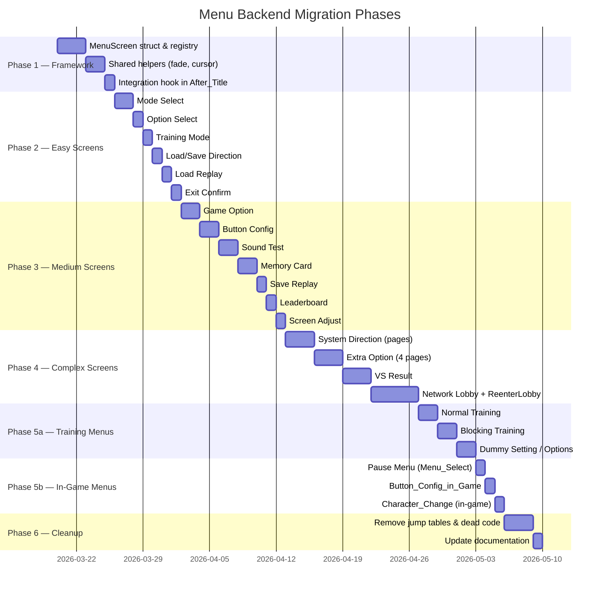

# Menu Backend Migration Plan

> **Status**: Draft — awaiting review  
> **Scope**: Backend state machine and navigation logic only (rendering is handled by the existing RmlUi Phase 3 migration)  
> **Companion**: see also `docs/menu_backend_investigation.md` (internal artifact) for raw analysis

---

## Table of Contents

1. [Executive Summary](#1-executive-summary)
2. [Problem Statement](#2-problem-statement)
3. [Current Architecture Deep-Dive](#3-current-architecture-deep-dive)
4. [Proposed Architecture](#4-proposed-architecture)
5. [Screen Inventory & Complexity Map](#5-screen-inventory--complexity-map)
6. [Global State Dependency Map](#6-global-state-dependency-map)
7. [Migration Phases](#7-migration-phases)
8. [Detailed Phase Specifications](#8-detailed-phase-specifications)
9. [Netplay / GameState Compatibility](#9-netplay--gamestate-compatibility)
10. [Menu Bridge (Python RL) Compatibility](#10-menu-bridge-python-rl-compatibility)
11. [Testing Strategy](#11-testing-strategy)
12. [Risk Assessment](#12-risk-assessment)
13. [File Manifest](#13-file-manifest)
14. [Appendix A: Utility Function Specifications](#appendix-a-utility-function-specifications-code-verified)
15. [Appendix B: Complete Transition Graph](#appendix-b-complete-transition-graph)
16. [Appendix C: free[] Array Usage Map](#appendix-c-free-array-usage-map)
17. [Appendix D: Fallthrough & Goto Inventory](#appendix-d-fallthrough--goto-inventory)
18. [Appendix E: Sound Effect Call Map](#appendix-e-sound-effect-call-map)
19. [Appendix F: Pre-Migration Regression Test Checklist](#appendix-f-pre-migration-regression-test-checklist)

---

## 1. Executive Summary

The in-game menu system is a **~7,556-line C monolith** (`menu.c` + `menu_input.c`) inherited from the CPS3 arcade board. Navigation is driven by nested integer indices (`r_no[0..3]`) into function-pointer jump tables, with **~50+ mutable global variables** controlling cursor state, transitions, rendering layers, and game mode. There are no named states, no screen lifecycle hooks, and every screen manually re-implements fade, cursor, and exit logic.

This document proposes replacing the backend with a **data-driven `MenuScreen` registry** that provides named screens, standardized lifecycle callbacks (`on_enter`/`on_tick`/`on_exit`), and shared helpers for fade, cursor, and navigation — while preserving full compatibility with:

- The existing **RmlUi Phase 3** rendering overlays (40+ C++ files)
- The **netplay `GameState`** save/load rollback contract
- The **`MenuBridge`** shared-memory interface for Python RL tools

The migration is designed to be **incremental** — one screen at a time — and each step can be independently verified.

---

## 2. Problem Statement

### 2.1 Symptoms

| Issue | Impact |
|:------|:-------|
| Adding a new menu screen requires editing 3–5 locations | Developer velocity |
| No named states — `r_no[1] = 21` means "Network Lobby" but you must count jump-table entries | Readability, onboarding |
| Screen logic mixes rendering (`effect_XX_init`) with navigation (`r_no` assignments) | Separation of concerns |
| Input handling is copy-pasted across 14+ screens with different max-item counts | Bug surface, consistency |
| No standardized enter/exit lifecycle — transitions manually zero 5+ globals | Fragile transitions, state leaks |
| Fade-in/fade-out boilerplate duplicated in every screen's first 3 `case` blocks | Code duplication (~600 lines) |
| `Menu_ReenterNetworkLobby()` must manually reconstruct 30+ globals to re-enter a screen | Maintenance nightmare |

### 2.2 What This Migration Does NOT Do

- **Replace rendering** — that's the existing RmlUi Phase 3 effort
- **Change the netplay state contract** — all `GameState` fields remain identical
- **Remove globals** — globals stay as the authoritative state; we just provide cleaner access patterns
- **Refactor the TASK system** — `Menu_Task()` remains the frame-level entry point
- **Migrate non-menu `Menu_Jmp_Tbl` entries** — the top-level table has 14 entries but only 3 dispatch paths contain actual *menu screens* (`After_Title`, `In_Game`, `Training_Menu`). The remaining 8 entries are transient I/O states, pause handlers, and replay mode reset sequences with no menu navigation (no cursor, no fade pattern, no RmlUi overlays). They are **excluded** from the `MenuScreen` registry:

| `r_no[0]` | Function | Why Excluded |
|:---------:|:---------|:-------------|
| 2 | `Wait_Load_Save` | Transient save/load I/O state machine — no user cursor navigation |
| 3 | `Wait_Replay_Check` | Replay validation wait (returns to After_Title on completion) |
| 4 | `Disp_Auto_Save` | Auto-save display sequence (transitions back to After_Title) |
| 5 | `Suspend_Menu` | No-op stub — game takes over frame control |
| 6 | `Wait_Replay_Load` | Replay load wait — no UI, just I/O |
| 8 | `After_Replay` | Post-replay screen (dispatches on `r_no[1]`, not `r_no[2]`); uses `Back_to_Mode_Select()` and `Exit_Sub()` to return |
| 9 | `Disp_Auto_Save2` | Variant auto-save display (same as index 4) |
| 10 | `Wait_Pause_in_Tr` | Training pause handler — transitions to/from Training_Menu |
| 11 | `Reset_Training` | Training reset sequence — reconstitutes Training_Menu state |
| 12 | `Reset_Replay` | Replay reset/end sequence |
| 13 | `End_Replay_Menu` | End-of-replay menu (retry/save/exit) — simple 3-item dispatch |

> [!IMPORTANT]
> **`After_Replay` (index 8)** uniquely dispatches on `r_no[1]` instead of `r_no[2]`. It calls `Exit_Sub()` and `Back_to_Mode_Select()` to transition to migrated screens. During Phase 4, verify that `Exit_Sub(task_ptr, cursor_ix, next_routine)` still works when `next_routine` points to a migrated screen (the integration hook in `After_Title()` must intercept the `r_no[1]` value and route to `MenuScreen_Goto()`). Similarly, `End_Replay_Menu` (index 13) can transition to `After_Title` via `r_no[0] = 0` — this path re-enters the `After_Title` dispatch and the new integration hook will handle it correctly.

---

## 3. Current Architecture Deep-Dive

### 3.1 File Layout

```
src/sf33rd/Source/Game/menu/
├── menu.c              (4,985 lines / 154 KB)  — state machine + screen logic
├── menu_input.c        (2,571 lines /  68 KB)  — cursor + toggle handlers
├── menu_internal.h     (  121 lines)           — shared internal declarations
├── menu.h              (   31 lines)           — public API
├── menu_draw.c         (  132 lines)           — minor draw helpers
├── dir_data.c/h        (   92 + hdr lines)     — SysDir data tables
└── ex_data.c/h         (  619 lines)           — Extra Option data tables

src/include/
├── menu_bridge.h       (  129 lines)           — Python RL shared-memory interface
└── game_state.h        (  800 lines)           — netplay rollback struct (includes menu globals)
```

### 3.2 The Dispatch Hierarchy

```
Menu_Task() ─────────────────────────── called every frame ─────────────────────
  │
  ├─ Menu_Jmp_Tbl[ r_no[0] ]           14-entry top-level dispatch table
  │   │
  │   ├─[0] After_Title ────────────── AT_Jmp_Tbl[ r_no[1] ] ──────────────────
  │   │       22 sub-screens (see §5 for complete inventory)
  │   │
  │   ├─[1] In_Game ────────────────── In_Game_Jmp_Tbl[ r_no[1] ] ─────────────
  │   │       5 entries: Menu_Init, Menu_Select, Button_Config_in_Game,
  │   │                  Character_Change, Pad_Come_Out
  │   │
  │   ├─[5] Suspend_Menu ──────────── no-op stub (game takes over) ─────────────
  │   │
  │   ├─[7] Training_Menu ─────────── Training_Jmp_Tbl[ r_no[1] ] ─────────────
  │   │       8 entries: Training_Init, Normal_Training, Blocking_Training,
  │   │                  Dummy_Setting, Training_Option, Button_Config_Tr,
  │   │                  Character_Change, Blocking_Tr_Option
  │   │
  │   └─ [2..6,8..13] Other top-level states (save/load I/O, replay, pause, etc.)
  │
  └─ Each screen: switch(r_no[2]) { case 0: init; case 1: wait; case 2: fadein; case 3: input; ... }
```

### 3.3 The Input Pipeline

```
┌─────────────────┐    ┌──────────────┐    ┌───────────────────┐    ┌──────────┐
│ PLsw[PL_id][0/1]│───▶│Check_Menu_   │───▶│ MC_Move_Sub()     │───▶│IO_Result │
│ (raw pad state) │    │Lever()       │    │ or Dir_Move_Sub2()│    │(consumed │
│                 │    │ (debounce +  │    │ (cursor wrapping  │    │ by screen│
│                 │    │  delay-shot  │    │  + SE_cursor_move)│    │  switch) │
│                 │    │  auto-repeat)│    │                   │    │          │
└─────────────────┘    └──────────────┘    └───────────────────┘    └──────────┘
                                                   │
                                           ┌───────▼────────┐
                                           │*_Move_Sub_LR() │
                                           │(left/right     │
                                           │ value toggle)  │
                                           └────────────────┘
```

**`Check_Menu_Lever(PL_id, type)`** (line 3208 of `menu.c`):
- Edge-detects button presses (`~plsw_01 & plsw_00`)
- Returns button bits immediately for attacks/Start
- For d-pad: returns edge on first press, then auto-repeats with configurable delay ramp (`Deley_Shot_No[PL_id]` through `Menu_Deley_Time[]`)
- The delay-shot values: initial=15, medium=10, fast=6 (separate LR delays: all 15, i.e. no acceleration for L/R)

### 3.4 The Fade Pattern (Duplicated ~14 Times)

Every screen follows this identical structure in its `switch(r_no[2])`:

```c
case 0:  /* INIT */
    FadeOut(1, 0xFF, 8);
    r_no[2] += 1;
    timer = 5;
    // ... setup effects, cursors, Menu_Suicide flags ...
    break;

case 1:  /* WAIT FOR EFFECTS */
    Menu_Sub_case1(task_ptr);  // decrements timer, sets r_no when done
    break;

case 2:  /* FADE IN */
    if (FadeIn(1, 0x19, 8) != 0) {
        r_no[2] += 1;
    }
    break;

case 3:  /* INPUT LOOP */
    MC_Move_Sub(Check_Menu_Lever(...), 0, MAX_ITEMS, 0xFF);
    switch (IO_Result) { ... }
    break;

// case 4+: exit/transition
```

---

## 4. Proposed Architecture

### 4.1 MenuScreen Struct

```c
/* src/include/port/menu_screen.h (NEW) */

typedef enum MenuScreenId {
    MENU_SCREEN_NONE = -1,

    /* --- After_Title screens (r_no[0]=0) --- */
    MENU_SCREEN_MODE_SELECT = 0,
    MENU_SCREEN_OPTION_SELECT,
    MENU_SCREEN_GAME_OPTION,
    MENU_SCREEN_BUTTON_CONFIG,
    MENU_SCREEN_SOUND_TEST,
    MENU_SCREEN_MEMORY_CARD,
    MENU_SCREEN_SYSTEM_DIRECTION,
    MENU_SCREEN_EXTRA_OPTION,
    MENU_SCREEN_DIRECTION_MENU,
    MENU_SCREEN_TRAINING_MODE,
    MENU_SCREEN_LOAD_REPLAY,
    MENU_SCREEN_EXIT_CONFIRM,
    MENU_SCREEN_VS_RESULT,
    MENU_SCREEN_SAVE_REPLAY,
    MENU_SCREEN_NETWORK_LOBBY,
    MENU_SCREEN_NETWORK_LOBBY_LAN,
    MENU_SCREEN_LEADERBOARD,     /* proposed split from Network_Lobby phases 4–8 */
    MENU_SCREEN_SCREEN_ADJUST,   /* sub-screen of Option_Select (Screen_Adjust_Sub) */

    /* --- In_Game screens (r_no[0]=1) — Phase 5b --- */
    MENU_SCREEN_PAUSE_MENU,      /* Menu_Select (in-game pause menu) */
    MENU_SCREEN_BUTTON_CONFIG_IG,/* Button_Config_in_Game */
    MENU_SCREEN_CHAR_CHANGE_IG,  /* Character_Change (in-game) */
    /* Pad_Come_Out is a no-op stub — not migrated */

    MENU_SCREEN_COUNT
} MenuScreenId;

typedef enum MenuScreenPhase {
    MENU_PHASE_ENTER,     /* one-shot: setup effects, show RmlUi doc     */
    MENU_PHASE_WAIT,      /* wait for timer / asset loads                */
    MENU_PHASE_FADE_IN,   /* FadeIn transition                          */
    MENU_PHASE_ACTIVE,    /* per-frame input handling                    */
    MENU_PHASE_FADE_OUT,  /* FadeOut before transition                   */
    MENU_PHASE_EXIT,      /* one-shot: cleanup, hide RmlUi doc           */
} MenuScreenPhase;

typedef struct MenuScreen {
    const char*       name;          /* "mode_select", etc.              */
    MenuScreenId      id;           
    MenuScreenId      parent;        /* screen to return to on cancel    */

    /* Lifecycle callbacks — all receive the TASK_MENU task pointer */
    void (*on_enter)(struct _TASK*);  /* called once on screen entry     */
    void (*on_tick)(struct _TASK*);   /* called every frame while active */
    void (*on_exit)(struct _TASK*);   /* called once on screen exit      */

    /* Cursor config (cursor_max may be overridden at runtime in on_enter
       for screens whose item count is conditional, e.g. Option_Select
       shows 6 or 7 items depending on Extra_Option unlock state) */
    int              cursor_max;     /* max menu items (for MC_Move_Sub) */
    int              cancel_item;    /* item index that means "exit"     */

    /* RmlUi integration */
    void (*rmlui_show)(void);        /* nullable: show RmlUi document   */
    void (*rmlui_hide)(void);        /* nullable: hide RmlUi document   */

    /* Effect config */
    MenuHeader       header_type;    /* MENU_HEADER_MODE_MENU, etc.     */
    u8               effect_slot;    /* Order[] slot for header bar     */
} MenuScreen;
```

### 4.2 Registry & Dispatcher

```c
/* src/port/menu_screen_registry.c (NEW) */

static MenuScreen g_screens[MENU_SCREEN_COUNT] = { ... };
static MenuScreenId     g_current_screen = MENU_SCREEN_NONE;
static MenuScreenId     g_next_screen    = MENU_SCREEN_NONE;
static MenuScreenPhase  g_phase          = MENU_PHASE_ENTER;

void MenuScreen_Goto(MenuScreenId id);   /* request transition       */
void MenuScreen_Back(void);              /* go to parent screen      */
void MenuScreen_Tick(struct _TASK*);     /* per-frame dispatcher     */
```

#### Dispatcher Phase Machine

`MenuScreen_Tick()` is called once per frame. It advances through phases automatically, calling lifecycle callbacks at the appropriate moments:

```
MenuScreen_Tick(task_ptr):
  if g_next_screen != MENU_SCREEN_NONE:
      // ── Deferred transition (set by Goto/Back on previous frame) ──
      if g_current_screen != MENU_SCREEN_NONE:
          g_screens[g_current_screen].on_exit(task_ptr)
          if rmlui_hide: rmlui_hide()
      g_current_screen = g_next_screen
      g_next_screen    = MENU_SCREEN_NONE
      g_phase          = MENU_PHASE_ENTER

  switch (g_phase):
    MENU_PHASE_ENTER:
        g_screens[g_current_screen].on_enter(task_ptr)
        if rmlui_show: rmlui_show()
        g_phase = MENU_PHASE_WAIT
        // does NOT fall through — wait starts next frame

    MENU_PHASE_WAIT:
        if MenuScreen_WaitTimer(task_ptr) completes:
            FadeInit()
            g_phase = MENU_PHASE_FADE_IN

    MENU_PHASE_FADE_IN:
        if FadeIn(1, 0x19, 8) != 0:
            g_phase = MENU_PHASE_ACTIVE

    MENU_PHASE_ACTIVE:
        g_screens[g_current_screen].on_tick(task_ptr)
        // on_tick may call MenuScreen_Goto/Back, which sets g_next_screen
        // (processed on the NEXT frame — never re-entrant)

    MENU_PHASE_FADE_OUT:
        if FadeOut(1, 0x19, 8) != 0:
            g_phase = MENU_PHASE_EXIT

    MENU_PHASE_EXIT:
        // one-shot cleanup (on_exit + rmlui_hide already called
        // in the deferred-transition block above, so this phase is
        // only reached for "exit to non-registry code" paths)
        g_screens[g_current_screen].on_exit(task_ptr)
        if rmlui_hide: rmlui_hide()
        g_current_screen = MENU_SCREEN_NONE
```

#### Transition Semantics

- **`MenuScreen_Goto(id)`**: Sets `g_next_screen = id`. The actual transition (current screen's `on_exit` → new screen's `on_enter`) happens at the **top of the next `MenuScreen_Tick` call**, never mid-frame. This prevents re-entrant lifecycle callbacks.
- **`MenuScreen_Back()`**: Equivalent to `MenuScreen_Goto(g_screens[g_current_screen].parent)`.
- **`MenuScreen_RequestFadeOut()`**: Transitions the current screen from `MENU_PHASE_ACTIVE` to `MENU_PHASE_FADE_OUT`. Used by screens that need an animated exit before the `Goto/Back` call (e.g. `Exit_Sub` replacements).

#### Canonical Transition Flow (Fade-Out → Navigate)

Most existing screens do: confirm → `Exit_Sub` fade-out → set `r_no[1]`. The new system replicates this as a **two-step call from `on_tick`**:

```c
/* Step 1: on confirm/cancel, request the fade-out */
MenuScreen_RequestFadeOut();  // sets g_phase = MENU_PHASE_FADE_OUT

/* Step 2: on_tick is still called each frame during FADE_OUT.
   Check if fade completed, then navigate. */
if (MenuScreen_GetPhase() == MENU_PHASE_EXIT) {
    MenuScreen_Goto(MENU_SCREEN_OPTION_SELECT);  // or Back()
}
```

> [!IMPORTANT]
> **`MenuScreen_Goto()` does NOT automatically trigger a fade-out.** If called directly from `MENU_PHASE_ACTIVE`, the transition happens immediately (next frame) with no visual fade. Screens that need a graceful exit **must** call `MenuScreen_RequestFadeOut()` first. The only exception is hard-reset paths (e.g. `Back_to_Mode_Select`) where an abrupt cut is intended.

### 4.3 Shared Helpers

```c
/* src/port/menu_screen_helpers.c (NEW) */

/* Replaces the duplicated fade pattern */
bool MenuScreen_FadeOut(struct _TASK*, int speed);
bool MenuScreen_FadeIn(struct _TASK*, int speed);
bool MenuScreen_WaitTimer(struct _TASK*);

/* Replaces per-screen MC_Move_Sub + Check_Menu_Lever calls */
u16  MenuScreen_HandleCursor(int cursor_max);
u16  MenuScreen_HandleCursorLR(void);

/* Standard enter/exit sequences — replaces Menu_in_Sub / Exit_Sub */
void MenuScreen_EnterSub(struct _TASK*, MenuHeader hdr, u8 slot);
void MenuScreen_ExitToParent(struct _TASK*);

/* Multi-frame fade-out exit — replaces Exit_Sub's free[0] phase counter.
   Call from on_tick; returns true when fade is complete. The caller
   should then call MenuScreen_Goto/Back to trigger the transition. */
bool MenuScreen_ExitFade(struct _TASK*, s16 cursor_ix);

/* Hard reset to Mode Select — replaces Back_to_Mode_Select().
   Used by VS_Result (after match exit) and After_Replay (case 4).
   Performs: full G_No/E_No reset, System_all_clear_Level_B(),
   Menu_Init() bootstrap, BGM restart, then Goto(MODE_SELECT). */
void MenuScreen_HardReset(struct _TASK*);

/* Exit to legacy (non-registry) dispatch paths — clears g_current_screen
   so MenuScreen_IsActive() returns false. The caller sets r_no directly. */
void MenuScreen_ExitToLegacy(struct _TASK*);

/* Query current phase from on_tick (for fade-out completion checks) */
MenuScreenPhase MenuScreen_GetPhase(void);
```

### 4.4 Integration Point

The key integration is a **single change in `After_Title()`**:

```diff
 static void After_Title(struct _TASK* task_ptr) {
+    /* Phase 2+: Screens migrated to the registry dispatch here */
+    if (MenuScreen_IsActive()) {
+        MenuScreen_Tick(task_ptr);
+        return;
+    }
+
+    /* Intercept r_no[1] values that map to migrated screens */
+    MenuScreenId mapped = MenuScreen_FromLegacyIndex(task_ptr->r_no[1]);
+    if (mapped != MENU_SCREEN_NONE) {
+        MenuScreen_Goto(mapped);
+        MenuScreen_Tick(task_ptr);
+        return;
+    }
+
     /* Legacy dispatch for un-migrated screens */
     void (*AT_Jmp_Tbl[AT_JMP_COUNT])() = { ... };
     ...
 }
```

This allows migrated and legacy screens to **coexist** during the incremental migration.

#### 4.4.1 Bidirectional Legacy ↔ Migrated Transition Protocol

During Phases 2–5, migrated and legacy screens must transition to each other. The protocol:

**Legacy → Migrated** (e.g. `Exit_Sub` sets `r_no[1]` to a migrated screen's index):
- The integration hook at the top of `After_Title()` calls `MenuScreen_FromLegacyIndex(r_no[1])` to check if the target is a migrated screen.
- If yes, it calls `MenuScreen_Goto(mapped)` and dispatches via the registry.
- `MenuScreen_FromLegacyIndex()` is a simple lookup table:

```c
/* In menu_screen_registry.c — maps AT_Jmp_Tbl indices to MenuScreenId.
   Returns MENU_SCREEN_NONE for un-migrated screens (legacy handles them).
   IMPORTANT: Option_Select has FOUR alias indices (2, 3, 7, 15) — all must
   map to MENU_SCREEN_OPTION_SELECT when migrated. Missing any alias causes
   Return_Option_Mode_Sub (which sets r_no[1]=7) to fall into legacy dispatch. */
static const MenuScreenId g_legacy_to_screen[AT_JMP_COUNT] = {
    [0]  = MENU_SCREEN_NONE,          /* Menu_Init (bootstrap) */
    [1]  = MENU_SCREEN_MODE_SELECT,   /* Mode_Select — only after Phase 2 */
    [2]  = MENU_SCREEN_OPTION_SELECT, /* Option_Select */
    [3]  = MENU_SCREEN_OPTION_SELECT, /* Option_Select (alias) */
    [7]  = MENU_SCREEN_OPTION_SELECT, /* Option_Select (alias — Return_Option_Mode_Sub target) */
    [15] = MENU_SCREEN_OPTION_SELECT, /* Option_Select (alias) */
    // ... populated as each screen is migrated ...
    [21] = MENU_SCREEN_NETWORK_LOBBY, /* Network_Lobby — only after Phase 4 */
};
```

**Migrated → Legacy** (e.g. Mode_Select → Arcade mode sets `r_no[0] = 5`):
- The screen's `on_tick` callback sets `r_no` directly (same as legacy code) and calls `MenuScreen_ExitToLegacy()` which sets `g_current_screen = MENU_SCREEN_NONE` so `MenuScreen_IsActive()` returns `false` on the next frame.

```c
/* src/port/menu_screen_helpers.c */
void MenuScreen_ExitToLegacy(struct _TASK* tp) {
    if (g_current_screen != MENU_SCREEN_NONE) {
        g_screens[g_current_screen].on_exit(tp);
        if (g_screens[g_current_screen].rmlui_hide)
            g_screens[g_current_screen].rmlui_hide();
    }
    g_current_screen = MENU_SCREEN_NONE;
    g_next_screen    = MENU_SCREEN_NONE;
    g_phase          = MENU_PHASE_ENTER;
}
```

**Migrated → Migrated** (normal path):
- Calls `MenuScreen_Goto(target)` as described in §4.2.

---

## 5. Screen Inventory & Complexity Map

### 5.1 AT_Jmp_Tbl Screens (r_no[0]=0, r_no[1]=index)

| Index | Function | Screen Name | Lines | Phases | RmlUi Overlay | Complexity |
|:-----:|:---------|:------------|------:|:------:|:------|:-----------|
| 0 | `Menu_Init` | (bootstrap) | ~45 | 1 | — | ⬜ Low |
| 1 | `Mode_Select` | Mode Select | ~155 | 4 | `rmlui_mode_menu` | 🟩 Low |
| 2 | `Option_Select` | Option Menu | ~140 | 4 | `rmlui_option_menu` | 🟩 Low |
| 3 | `Option_Select` | (alias) | — | — | — | — |
| 4 | `Training_Mode` | Training Selector | ~110 | 4 | `rmlui_training_menus` | 🟩 Low |
| 5 | `System_Direction` | System Direction | ~200 | 5 | `rmlui_sysdir` | 🟨 Medium |
| 6 | `Load_Replay` | Load Replay | ~30 | 2 | `rmlui_replay_picker` | 🟩 Low |
| 7 | `Option_Select` | (alias) | — | — | — | — |
| 8 | `toSelectGame` | Exit Confirm | ~130 | 10 | `rmlui_exit_confirm` | 🟨 Medium |
| 9 | `Game_Option` | Game Options | ~250 | 5 | `rmlui_game_option` | 🟨 Medium |
| 10 | `Button_Config` | Button Config | ~200 | 5 | `rmlui_button_config` | 🟨 Medium |
| 11 | `System_Direction` | SysDir (from Option) | — | — | — | — |
| 12 | `Sound_Test` | Sound Test | ~200 | 5 | `rmlui_sound_menu` | 🟨 Medium |
| 13 | `Memory_Card` | Memory Card | ~150 | 5 | `rmlui_memory_card` | 🟨 Medium |
| 14 | `Extra_Option` | Extra Option (4pg) | ~200 | 5 | `rmlui_extra_option` | 🟧 High |
| 15 | `Option_Select` | (alias) | — | — | — | — |
| 16 | `VS_Result` | VS Result Tally | ~300 | 8 | `rmlui_vs_result` | 🟧 High |
| 17 | `Save_Replay` | Save Replay | ~100 | 4 | `rmlui_replay_picker` | 🟨 Medium |
| 18 | `Direction_Menu` | Direction Page Nav | ~100 | 3 | `rmlui_sysdir` | 🟨 Medium |
| 19 | `Save_Direction` | Save Direction | ~60 | 4 | — | 🟩 Low |
| 20 | `Load_Direction` | Load Direction | ~60 | 4 | — | 🟩 Low |
| 21 | `Network_Lobby` | Network Lobby | ~1,230 | ~18 | `rmlui_network_lobby` | 🟥 Very High |
| — | `Screen_Adjust_Sub` | Screen Adjust | ~80 | 3 | — | 🟨 Medium |

> [!NOTE]
> The Leaderboard is currently embedded as Network_Lobby phases 4–8 (not a separate AT entry). The proposed `MENU_SCREEN_LEADERBOARD` is a refactoring split. `Screen_Adjust` is a sub-screen of `Option_Select` implemented in `Screen_Adjust_Sub()` ([menu_input.c:918](file:///d:/3sxtra/src/sf33rd/Source/Game/menu/menu_input.c#L918)). It has its own input loop and is migrated as a full `MenuScreen` entry in Phase 3.

### 5.2 Training_Jmp_Tbl Screens (r_no[0]=7, r_no[1]=index)

| Index | Function | Screen Name | Lines | Complexity |
|:-----:|:---------|:------------|------:|:-----------|
| 0 | `Training_Init` | (bootstrap) | ~25 | ⬜ Low |
| 1 | `Normal_Training` | Normal Training Menu | ~130 | 🟧 High |
| 2 | `Blocking_Training` | Parry Training Menu | ~100 | 🟨 Medium |
| 3 | `Dummy_Setting` | Dummy Config | ~55 | 🟨 Medium |
| 4 | `Training_Option` | Training Options | ~60 | 🟨 Medium |
| 5 | `Button_Config_Tr` | Training Button Config | ~30 | 🟩 Low |
| 6 | `Character_Change` | Change Character | ~80 | 🟨 Medium |
| 7 | `Blocking_Tr_Option` | Parry Training Options | ~50 | 🟨 Medium |

### 5.3 In_Game_Jmp_Tbl (r_no[0]=1, r_no[1]=index) — Phase 5b Scope

| Index | Function | Lines | Complexity | Migration? |
|:-----:|:---------|------:|:-----------|:-----------|
| 0 | `Menu_Init` | — | ⬜ | No (bootstrap) |
| 1 | `Menu_Select` | ~100 | 🟨 Medium | ✅ `MENU_SCREEN_PAUSE_MENU` |
| 2 | `Button_Config_in_Game` | ~80 | 🟨 Medium | ✅ `MENU_SCREEN_BUTTON_CONFIG_IG` (shared helper) |
| 3 | `Character_Change` | ~80 | 🟨 Medium | ✅ `MENU_SCREEN_CHAR_CHANGE_IG` |
| 4 | `Pad_Come_Out` | 1 | ⬜ | ❌ No-op stub — keep as-is |

---

## 6. Global State Dependency Map

The following globals are **written by menu screens** and must be preserved during migration. The "GameState" column indicates whether the variable is part of the netplay rollback struct.

### 6.1 Core Navigation Globals

| Global | Type | Written By | GameState? | Purpose |
|:-------|:-----|:-----------|:----------:|:--------|
| `Menu_Cursor_Y[2]` | `s8[2]` | All screens | ✅ | Current cursor position per player |
| `Menu_Cursor_X[2]` | `s8[2]` | Memory Card, Replay | ✅ | Horizontal cursor (file select) |
| `IO_Result` | `u16` | Input pipeline | ✅ | Button/direction event this frame |
| `Menu_Cursor_Move` | `s8` | Screen init | ✅ | Countdown timer (blocks input) |
| `Menu_Suicide[4]` | `u8[4]` | Transitions | ✅ | Kill effects on specific layers |
| `Menu_Page` | `s8` | SysDir, Extra Option | ✅ | Current page in multi-page menus |
| `Menu_Max` | `s8` | SysDir, Extra Option | ✅ | Max items on current page |
| `Menu_Page_Buff` | `s8` | Page transitions | ✅ | Previous page (for animation) |
| `Cursor_Y_Pos[2][4]` | `s8[2][4]` | Mode Select | ✅ | Saved cursor positions per level |

### 6.2 Game Mode Globals

| Global | Type | Written By | GameState? | Purpose |
|:-------|:-----|:-----------|:----------:|:--------|
| `Mode_Type` | `ModeType` | Mode Select, Training | ✅ | Arcade/VS/Training/Network/etc. |
| `Present_Mode` | `u8` | Mode Select, Training | ✅ | Which config slot to use |
| `Play_Type` | `u8` | Various | ✅ | Sub-mode differentiator |
| `G_No[4]` | `u8[4]` | Transitions | ✅ | Top-level game state machine |

### 6.3 Rendering State

| Global | Type | Written By | GameState? | Purpose |
|:-------|:-----|:-----------|:----------:|:--------|
| `Order[148]` | `u8[148]` | All screens | ✅ | Effect slot visibility |
| `Order_Timer[148]` | `u8[148]` | All screens | ✅ | Effect slot timers |
| `Order_Dir[148]` | `u8[148]` | All screens | ✅ | Effect slot direction flags |
| `Unsubstantial_BG[4]` | `u8[4]` | Menu_Init | ✅ | Background transparency |

### 6.4 Settings Buffers

| Global | Type | Written By | GameState? | Purpose |
|:-------|:-----|:-----------|:----------:|:--------|
| `Convert_Buff[4][2][12]` | `s8[4][2][12]` | Game Option, Button Config, SysDir | ✅ | Working copies of settings |
| `Direction_Working[6]` | `u8[6]` | SysDir | ✅ | Active dipswitch values |
| `Vital_Handicap[6][2]` | `s8[6][2]` | Mode Select, VS | ✅ | Vitality handicap |

---

## 7. Migration Phases



### Complexity Budget (Estimated Lines Changed Per Phase)

| Phase | New Lines | Deleted Lines | Net |
|:------|----------:|--------------:|----:|
| 1 — Framework | ~350 | 0 | +350 |
| 2 — Easy Screens | ~400 | ~450 | −50 |
| 3 — Medium Screens | ~550 | ~650 | −100 |
| 4 — Complex Screens | ~700 | ~900 | −200 |
| 5a — Training Menus | ~300 | ~350 | −50 |
| 5b — In-Game Menus | ~200 | ~200 | 0 |
| 6 — Cleanup | ~50 | ~500 | −450 |
| **Total** | **~2,550** | **~3,050** | **−500** |

---

## 8. Detailed Phase Specifications

### Phase 1: Framework (No Behavior Change)

**Goal**: Define the `MenuScreen` infrastructure without changing any existing behavior.

#### New Files

| File | Purpose |
|:-----|:--------|
| `src/include/port/menu_screen.h` | `MenuScreen` struct, `MenuScreenId` enum, `MenuScreenPhase` enum, API declarations |
| `src/port/menu_screen_registry.c` | Screen registry array, `MenuScreen_Tick()` dispatcher, `MenuScreen_Goto()` / `MenuScreen_Back()` |
| `src/port/menu_screen_helpers.c` | `MenuScreen_FadeOut()`, `MenuScreen_FadeIn()`, `MenuScreen_WaitTimer()`, `MenuScreen_HandleCursor()`, `MenuScreen_EnterSub()`, `MenuScreen_ExitToParent()` |

#### Modified Files

| File | Change |
|:-----|:-------|
| `src/sf33rd/Source/Game/menu/menu.c` | Add `#include "port/menu_screen.h"` and the integration hook in `After_Title()` |
| `CMakeLists.txt` | Add new source files to build |

#### Acceptance Criteria

- Project compiles and links with no warnings
- All existing menu screens work identically (the integration hook is gated by `MenuScreen_IsActive()` which returns `false` initially)
- No functional change whatsoever

---

### Phase 2: Easy Screens (Simple State Machines)

**Goal**: Migrate the simplest screens to validate the framework.

For each screen, the migration follows this template:

1. **Create `on_enter` callback**: Extract the screen's `case 0` (init) content
2. **Create `on_tick` callback**: Extract the screen's `case 3` (input loop) content, using `MenuScreen_HandleCursor()` instead of raw `MC_Move_Sub(Check_Menu_Lever(...))` calls
3. **Create `on_exit` callback**: Extract the cleanup / `Menu_Suicide` / `Order[]` reset code
4. **Register** the screen in `g_screens[]`
5. **Update the transition sites**: Replace `r_no[1] = X` assignments with `MenuScreen_Goto(MENU_SCREEN_X)` calls
6. **Remove the old `case` block** from `After_Title()` (or comment it out behind a toggle)

#### Rollback Toggle Strategy

During the multi-week migration, each screen has a compile-time toggle to revert to legacy dispatch:

```c
/* In menu_screen_registry.c — set to 0 to disable a migrated screen */
#define MENU_USE_NEW_MODE_SELECT      1
#define MENU_USE_NEW_OPTION_SELECT    1
// ... one #define per screen ...
```

When a toggle is `0`, `MenuScreen_IsActive()` will not claim that screen, and the legacy jump table entry handles it. This allows reverting a single buggy screen without a full `git revert`.

> [!CAUTION]
> **The rollback toggle must also gate `MenuScreen_FromLegacyIndex()`**, not just `MenuScreen_IsActive()`. Otherwise a legacy screen calling `Exit_Sub(task_ptr, ix, 2)` would still route to the disabled migrated Option_Select via the lookup table. Implementation:
>
> ```c
> MenuScreenId MenuScreen_FromLegacyIndex(int idx) {
>     MenuScreenId id = g_legacy_to_screen[idx];
>     if (id != MENU_SCREEN_NONE && !g_screen_enabled[id])
>         return MENU_SCREEN_NONE;  // rollback toggle is off — let legacy handle it
>     return id;
> }
> ```

#### Mode Select (First Migration — Template)

```c
/* Before (in menu.c, ~155 lines across 4 cases): */
static void Mode_Select(struct _TASK* task_ptr) {
    switch (task_ptr->r_no[2]) {
    case 0: /* ... 55 lines of init ... */
    case 1: /* ... wait ... */
    case 2: /* ... fade in ... */
    case 3: /* ... 60 lines of input handling ... */
    default: /* ... exit ... */
    }
}

/* After (in menu_screen_mode_select.c, ~80 lines): */
static void mode_select_enter(struct _TASK* tp) {
    MenuScreen_EnterSub(tp, MENU_HEADER_MODE_MENU, 0x64);
    // ... effect setup (~20 lines) ...
    if (use_rmlui && rmlui_menu_mode) rmlui_mode_menu_show();
}

static void mode_select_tick(struct _TASK* tp) {
    u16 result = MenuScreen_HandleCursor(6);  // 7 items - 1
    switch (result) {
    case 0x100:
        switch (Menu_Cursor_Y[0]) {
        case 0: MenuScreen_Goto(MENU_SCREEN_NONE); /* Arcade */ break;
        case 1: /* VS */ break;
        // ...
        }
        break;
    }
}

static void mode_select_exit(struct _TASK* tp) {
    if (use_rmlui && rmlui_menu_mode) rmlui_mode_menu_hide();
}
```

> [!IMPORTANT]
> **Alias Trap**: When `Option_Select` is migrated, `Return_Option_Mode_Sub()` (used by 10+ sub-screens to return to Option_Select) sets `r_no[1]=7` which goes through the legacy jump table. **All call sites of `Return_Option_Mode_Sub` must be updated** to call `MenuScreen_Goto(MENU_SCREEN_OPTION_SELECT)` instead. Do this as part of the Option_Select migration, not as a Phase 6 cleanup.

---

### Phase 3: Medium Screens

These screens add left/right value toggling on top of the basic cursor pattern. The `MenuScreen_HandleCursorLR()` helper absorbs the per-screen `*_Move_Sub_LR()` calls.

**Additional complexity**: Game Option and Button Config have value buffers (`Convert_Buff`) that must be committed on exit vs reverted on cancel.

#### Screen Adjust

`Screen_Adjust_Sub()` at [menu_input.c:918](file:///d:/3sxtra/src/sf33rd/Source/Game/menu/menu_input.c#L918) is a sub-screen of `Option_Select` with its own cursor loop. It adjusts X/Y screen position using `X_Adjust`, `Y_Adjust` globals. Migrate as `MENU_SCREEN_SCREEN_ADJUST` with parent `MENU_SCREEN_OPTION_SELECT`.

#### Shared Button Config Strategy

Three screens share button-mapping logic: `Button_Config` (AT index 10), `Button_Config_in_Game` (In_Game index 2), and `Button_Config_Tr` (Training index 5). To avoid triple-migrating:

```c
/* src/port/screens/ms_button_config.c */

/* Shared internal helper — all three variants call this */
static void button_config_common_tick(struct _TASK* tp, int player_count);
static void button_config_common_enter(struct _TASK* tp, int player_count);

/* Three thin wrappers registered as separate MenuScreen entries */
static void button_config_enter(struct _TASK* tp)     { button_config_common_enter(tp, 2); }
static void button_config_ig_enter(struct _TASK* tp)   { button_config_common_enter(tp, 1); }
static void button_config_tr_enter(struct _TASK* tp)   { button_config_common_enter(tp, 1); }
```

The `player_count` parameter differentiates the main menu (2-player config) from in-game/training (1-player).

---

### Phase 4: Complex Screens

#### System Direction & Extra Option
- **Multi-page**: `Menu_Page`, `Page_Max`, `Setup_Next_Page()` must be preserved
- **Strategy**: Add a `page` field to `MenuScreen` or use a `MenuScreen_PagedTick()` helper

#### VS Result
- **Multi-phase**: 8 sub-phases for netplay FT rotation, result display, replay save prompt
- **Strategy**: The `on_tick` callback can use an internal sub-phase enum (replacing `r_no[3]`)

#### Network Lobby
- **Most complex**: 24 phases, popup system, peer list rendering, challenge flow
- **Strategy**: Decompose into 3 sub-screens (Gateway, Lobby, LAN Lobby) each with their own `MenuScreen` entries, sharing lobby state via a `NetworkLobbyContext` struct

#### Menu_ReenterNetworkLobby Rewrite

`Menu_ReenterNetworkLobby()` ([menu.c:1879](file:///d:/3sxtra/src/sf33rd/Source/Game/menu/menu.c#L1879)) manually sets 30+ globals and pokes `r_no` / `free[]` directly to jump into the Network_Lobby at phase 10. **Once Network_Lobby is migrated**, this function must be rewritten to:

1. Call `MenuScreen_Goto(MENU_SCREEN_NETWORK_LOBBY)` instead of setting `r_no[1]=21`
2. Set a `g_lobby_reenter_from_match = true` flag so the `on_enter` callback can detect re-entry vs. fresh entry and configure the correct phase (blue background rebuild, RmlUI mode, peer list)
3. Keep the task reconstruction logic (`cpReadyTask`, `make_texcash_work`, etc.) — this is not dispatch code

This rewrite is **Phase 4 scope**, not Phase 6 cleanup, because it must be tested alongside the Network_Lobby migration.

> [!WARNING]
> **Reentrancy safety**: `Menu_ReenterNetworkLobby()` is called from outside the menu-frame loop (e.g., netplay disconnect callbacks). It calls `cpReadyTask(TASK_MENU, Menu_Task)` which creates a **fresh task struct** — so the `MenuScreen_Goto()` call sets state on the newly-created task, not on a live mid-frame task. Verify that `cpReadyTask` zeroes the task struct (including `free[]`) before the `MenuScreen_Goto` call.

#### VS Result → Back_to_Mode_Select Hard Reset

`Back_to_Mode_Select()` ([menu_input.c:2465](file:///d:/3sxtra/src/sf33rd/Source/Game/menu/menu_input.c#L2465)) zeros all `r_no`, reinitializes `G_No`/`E_No`, calls `System_all_clear_Level_B()`, and runs `Menu_Init()`. When VS_Result is migrated, the `on_tick` callback should call `MenuScreen_HardReset()` instead (see §4.3), which replicates the full reset sequence and ends with `MenuScreen_Goto(MENU_SCREEN_MODE_SELECT)`.

---

### Phase 5: Training Menus

Training menus run under `r_no[0]=7` (Training_Menu), not `r_no[0]=0` (After_Title). The integration hook must be extended.

> [!CAUTION]
> **`Training_Menu()` calls three rendering functions AFTER dispatching** to the training sub-screen: `Akaobi()` (red health-bar stripe overlay), `ToneDown(0xAA, 2)` (dim background), and `SSPutStr_Bigger()` (training menu title text). These run every frame and are visually essential. The integration hook must **not** skip them with an early `return`.

```diff
 static void Training_Menu(struct _TASK* task_ptr) {
-    void (*Training_Jmp_Tbl[TRAINING_JMP_COUNT])() = { ... };
-    Training_Jmp_Tbl[task_ptr->r_no[1]](task_ptr);
+    if (MenuScreen_IsTrainingActive()) {
+        MenuScreen_TrainingTick(task_ptr);
+    } else {
+        void (*Training_Jmp_Tbl[TRAINING_JMP_COUNT])() = { ... };
+        Training_Jmp_Tbl[task_ptr->r_no[1]](task_ptr);
+    }
+    /* These MUST run after BOTH legacy and migrated dispatch paths */
     Akaobi();
     ToneDown(0xAA, 2);
     if ((!use_rmlui || !rmlui_menu_training) && Training_Index < TRAINING_LETTER_COUNT)
         SSPutStr_Bigger(...);
 }
```

#### In_Game Menus

The `In_Game` dispatch path (`r_no[0]=1`) has 5 screens: `Menu_Init`, `Menu_Select` (pause menu), `Button_Config_in_Game`, `Character_Change`, and `Pad_Come_Out`. These require a similar integration hook:

```diff
 static void In_Game(struct _TASK* task_ptr) {
+    if (MenuScreen_IsInGameActive()) {
+        MenuScreen_InGameTick(task_ptr);
+        return;
+    }
     // legacy dispatch...
 }
```

> [!WARNING]
> `Button_Config_in_Game` and `Button_Config_Tr` share logic with `Button_Config`. All three use the shared `button_config_common_tick()` helper (see Phase 3 Button Config Strategy). `Pad_Come_Out` is a no-op stub ([menu_input.c:1663](file:///d:/3sxtra/src/sf33rd/Source/Game/menu/menu_input.c#L1663)) — it is **not migrated** and can be removed in Phase 6.

---

### Phase 5b: In-Game Menus (r_no[0]=1)

**Goal**: Migrate the 3 In_Game screens that have real logic.

| Screen | `MenuScreenId` | Shared Logic? | Estimated Lines |
|:-------|:---------------|:--------------|----------------:|
| `Menu_Select` (pause) | `MENU_SCREEN_PAUSE_MENU` | No | ~60 |
| `Button_Config_in_Game` | `MENU_SCREEN_BUTTON_CONFIG_IG` | Yes — `button_config_common_tick()` | ~30 (wrapper) |
| `Character_Change` | `MENU_SCREEN_CHAR_CHANGE_IG` | No | ~50 |

The integration hook in `In_Game()` follows the same `MenuScreen_IsInGameActive()` gate pattern used by `After_Title()` and `Training_Menu()`.

---

### Phase 6: Cleanup

After all screens are migrated:

1. Remove `AT_Jmp_Tbl`, `Menu_Jmp_Tbl` entries for migrated screens
2. Remove `r_no[1]` index magic numbers (replaced by `MenuScreenId` enum)
3. Simplify `Menu_ReenterNetworkLobby()` to use `MenuScreen_Goto(MENU_SCREEN_NETWORK_LOBBY)`
4. Update `MenuBridge_PostTick()` if any state names changed
5. Audit `GameState_Save/Load` — no changes expected, but verify

---

## 9. Netplay / GameState Compatibility

> [!IMPORTANT]
> The `GameState` struct in `game_state.h` saves and loads **all menu globals** (`Menu_Cursor_Y`, `Menu_Suicide`, `Order[]`, `Convert_Buff`, `G_No`, etc.) every frame during netplay rollback. **None of these fields can be renamed, retyped, or removed.**

### Compatibility Rules

1. **Menu globals remain global** — the `MenuScreen` callbacks read/write them directly
2. **No new fields in `GameState`** — the `MenuScreenId g_current_screen` and `MenuScreenPhase g_phase` are NOT saved in `GameState` because menu navigation doesn't run during gameplay rollback
3. **Phase validation**: During netplay, `r_no[0]` is either `1` (In_Game) or `5` (Suspend_Menu). The `After_Title` dispatch path (which uses the new registry) is only active when `Play_Game == 0` (in menus), so rollback never touches it.

---

## 10. Menu Bridge (Python RL) Compatibility

The `MenuBridgeState` struct in `menu_bridge.h` exposes:
- `nav_G_No[4]`, `nav_S_No[4]`, `nav_Play_Type`, `nav_Play_Game`
- `nav_My_char[2]`, `nav_Super_Arts[2]`
- Cursor positions and input injection buffers

**Impact**: None. The bridge reads from the same globals the new registry writes. The `MenuBridge_PostTick()` function copies globals into the SHM struct; it doesn't care about the dispatch mechanism.

---

## 11. Testing Strategy

### 11.1 Existing Tests

| Test | Command | What it covers |
|:-----|:--------|:---------------|
| `tests/unit/test_menu_bridge.c` | `ctest --test-dir build -R test_menu_bridge` | MenuBridge SHM serialization |

### 11.2 Build Verification (Phase 1)

```bash
cmake --build build --target 3sxtra 2>&1 | findstr /i "error warning"
```

Criteria: zero errors, zero new warnings.

### 11.3 Per-Screen Manual Verification

After migrating each screen, the following manual test should be performed:

1. **Launch the game** — navigate to the migrated screen
2. **Cursor movement** — press up/down, verify cursor wraps correctly
3. **Selection** — press confirm on each item, verify correct transition
4. **Cancel** — press cancel, verify return to parent screen
5. **Left/right toggles** — (if applicable) press left/right, verify value cycles
6. **RmlUi toggle** — if the screen has an RmlUi overlay, toggle it via the Mods Menu and verify both native and RmlUi rendering paths work
7. **Fade** — verify fade-out and fade-in animations are smooth, no flicker
8. **Sound** — verify cursor move SE and selection SE play correctly

### 11.4 Regression Tests

After each phase:

- **Full menu traversal**: Navigate through every screen accessible from Mode Select → Options → each sub-screen → back to Mode Select
- **Netplay session**: Start a local VS match, pause, verify pause menu still works, exit back to lobby
- **Training session**: Enter training mode, access all training sub-menus, exit
- **Replay**: Save and load a replay

### 11.5 Automated Test (NEW — Phase 1)

A new unit test to validate the `MenuScreen` registry:

```c
/* tests/unit/test_menu_screen.c (NEW) */
void test_all_screens_have_required_callbacks(void);    /* on_enter, on_tick, on_exit non-null */
void test_all_screens_have_valid_parent(void);          /* parent != self, parent exists */
void test_goto_sets_correct_phase(void);                /* MenuScreen_Goto → MENU_PHASE_ENTER */
void test_back_returns_to_parent(void);                 /* MenuScreen_Back → parent screen */
void test_cursor_max_positive(void);                    /* cursor_max > 0 for all active screens */
```

---

## 12. Risk Assessment

| Risk | Likelihood | Impact | Mitigation |
|:-----|:-----------|:-------|:-----------|
| Missed global reset during transition | Medium | Screen shows stale state | `on_exit` callback + `MenuScreen_ExitToParent()` helper standardizes cleanup |
| Netplay desync from changed menu globals | Low | Critical | Menu registry state is NOT in `GameState`; globals remain unchanged |
| RmlUi overlay timing mismatch | Low | Visual glitch | Show/hide calls remain in the same relative position in the lifecycle |
| Training menu cross-talk with main menu | Medium | Wrong screen appears | Separate `MenuScreen_IsTrainingActive()` gate keeps the two dispatch paths independent |
| `Menu_ReenterNetworkLobby()` breaks | Medium | Can't return to lobby after match | Rewrite in Phase 4 (not Phase 6); use `MenuScreen_Goto` + re-enter flag |
| `Return_Option_Mode_Sub` alias trap | Medium | Sub-screen returns to legacy dispatch instead of registry | Update all 10+ call sites during Phase 2 Option_Select migration |
| Partial migration causes hard-to-debug state | Low | Debugging nightmare | Per-screen compile-time rollback toggles (`MENU_USE_NEW_*`) |
| Shared Button Config divergence | Low | 3 variants drift apart | Single `button_config_common_tick()` helper called by all three wrappers |

---

## 13. File Manifest

### New Files

| Path | Size Est. | Purpose |
|:-----|----------:|:--------|
| `src/include/port/menu_screen.h` | ~80 lines | Struct defs, enum, API |
| `src/port/menu_screen_registry.c` | ~150 lines | Registry, dispatcher |
| `src/port/menu_screen_helpers.c` | ~120 lines | Fade, cursor, enter/exit helpers |
| `src/port/screens/ms_mode_select.c` | ~80 lines | Mode Select callbacks |
| `src/port/screens/ms_option_select.c` | ~60 lines | Option Menu callbacks |
| `src/port/screens/ms_game_option.c` | ~100 lines | Game Option callbacks |
| `src/port/screens/ms_button_config.c` | ~100 lines | Button Config callbacks |
| `src/port/screens/ms_sound_test.c` | ~80 lines | Sound Test callbacks |
| `src/port/screens/ms_memory_card.c` | ~70 lines | Memory Card callbacks |
| `src/port/screens/ms_sysdir.c` | ~120 lines | System Direction callbacks |
| `src/port/screens/ms_extra_option.c` | ~120 lines | Extra Option callbacks |
| `src/port/screens/ms_exit_confirm.c` | ~60 lines | Exit Confirm callbacks |
| `src/port/screens/ms_vs_result.c` | ~150 lines | VS Result callbacks |
| `src/port/screens/ms_network_lobby.c` | ~300 lines | Network Lobby callbacks |
| `src/port/screens/ms_screen_adjust.c` | ~50 lines | Screen Adjust callbacks |
| `src/port/screens/ms_training.c` | ~200 lines | Training menu callbacks |
| `src/port/screens/ms_pause_menu.c` | ~60 lines | In-game pause menu callbacks |
| `src/port/screens/ms_button_config_ig.c` | ~30 lines | In-game Button Config wrapper |
| `src/port/screens/ms_char_change_ig.c` | ~50 lines | In-game Character Change callbacks |
| `src/port/screens/ms_replay.c` | ~80 lines | Replay save/load callbacks |
| `src/port/screens/ms_leaderboard.c` | ~60 lines | Leaderboard callbacks (split from Network_Lobby phases 4–8) |
| `src/port/screens/ms_save_direction.c` | ~40 lines | Save Direction callbacks |
| `src/port/screens/ms_load_direction.c` | ~40 lines | Load Direction callbacks |
| `tests/unit/test_menu_screen.c` | ~100 lines | Registry unit tests |

### Modified Files

| Path | Change |
|:-----|:-------|
| `src/sf33rd/Source/Game/menu/menu.c` | Add integration hooks in `After_Title()` / `In_Game()`, gradually remove migrated screen functions |
| `src/sf33rd/Source/Game/menu/menu_input.c` | Update `Return_Option_Mode_Sub()` call sites to use `MenuScreen_Goto()` |
| `CMakeLists.txt` | Add new source files |

### Total Estimated New Code

~2,550 lines across ~21 new files, plus ~3,050 lines gradually deleted from `menu.c` as screens migrate (net reduction: ~500 lines).

---

## Appendix A: Utility Function Specifications (Code-Verified)

These are the shared functions that every screen relies on. Each must be faithfully replicated or reused by the new `MenuScreen` helpers.

### A.1 `MC_Move_Sub(sw, cursor_id, menu_max, cansel_menu)` — [menu_input.c:1343](file:///d:/3sxtra/src/sf33rd/Source/Game/menu/menu_input.c#L1343-L1407)

**Signature**: `u16 MC_Move_Sub(u16 sw, s16 cursor_id, s16 menu_max, s16 cansel_menu)`

**Behavior**:
1. If `Menu_Cursor_Move > 0`, returns 0 immediately (blocks input during effect animation countdown)
2. `SWK_UP` (0x1): decrements `Menu_Cursor_Y[cursor_id]`, wraps to `menu_max` if < 0. If the resulting position equals `cansel_menu` AND `Connect_Status == 0`, decrements again (skips disabled items). Calls `SE_cursor_move()`. Returns `IO_Result = SWK_UP`.
3. `SWK_DOWN` (0x2): increments, wraps to 0 if > `menu_max`. Same skip logic. Same SE. Returns `IO_Result = SWK_DOWN`.
4. All other SWK bits (`SWK_WEST`, `SWK_SOUTH`, `SWK_EAST`, `SWK_NORTH`, `SWK_START`, shoulder/trigger buttons): passed through directly as `IO_Result = sw`.
5. Default case: returns `IO_Result = 0`.
6. **Return value**: the value assigned to `IO_Result`.

**Critical detail**: The `cansel_menu` skip only fires when `Connect_Status == 0`. This is used to hide the "VS" option in Mode Select when no second player is connected. Passing `cansel_menu = 0xFF` effectively disables this skip (no menu_max will be that high).

**`cansel_menu` usage by screen** (all others pass `0xFF`):

| Screen | `cansel_menu` Value | Skipped Item |
|:-------|:-------------------:|:-------------|
| Mode_Select | `1` | VS (cursor pos 1) when no P2 connected |

The `MenuScreen_HandleCursor(cursor_max)` helper must accept an optional `skip_item` parameter (default `0xFF`) to replicate this behavior.

### A.2 `Check_Menu_Lever(PL_id, type)` — [menu.c:3208](file:///d:/3sxtra/src/sf33rd/Source/Game/menu/menu.c#L3208-L3257)

**Signature**: `u16 Check_Menu_Lever(u8 PL_id, s16 type)`

**Behavior**:
1. Edge-detect: `sw = ~plsw_01[PL_id] & plsw_00[PL_id]`
2. If `type != 0`: overrides to `sw = ~PLsw[PL_id][1] & PLsw[PL_id][0]` (uses `PLsw` instead of `plsw_XX` — this is the in-game pad buffer vs the menu-local copy)
3. `lever = plsw_00[PL_id] & SWK_DIRECTIONS` (held state)
4. If `sw` has any attack or START bit: return `sw` immediately (no delay-shot for buttons)
5. If `sw` has direction bits on edge: return `sw` immediately
6. If `lever == 0`: reset delay-shot state (`Deley_Shot_No[PL_id] = 0`), return 0
7. Auto-repeat: decrement `Deley_Shot_Timer[PL_id]`. When it reaches 0, advance `Deley_Shot_No` (capped at 2), pick delay from `Menu_Deley_Time[]`, return `lever`.

**`Menu_Deley_Time[6]`** — [menu.c:3192](file:///d:/3sxtra/src/sf33rd/Source/Game/menu/menu.c#L3192): `{ 15, 10, 6, 15, 15, 15 }`
- Indices 0–2: Up/Down delay values (slow → fast)
- Indices 3–5: Left/Right delay values (all 15, i.e. no acceleration for L/R)

### A.3 `Exit_Sub(task_ptr, cursor_ix, next_routine)` — [menu.c:3168](file:///d:/3sxtra/src/sf33rd/Source/Game/menu/menu.c#L3168-L3190)

**Signature**: `s32 Exit_Sub(struct _TASK* task_ptr, s16 cursor_ix, s16 next_routine)`

**Behavior** (two-phase, using `free[0]`):
1. `free[0] == 0`: sets `free[0] = 1`, calls `FadeInit()`, falls through to case 1
2. `free[0] == 1`: calls `FadeOut(1, 0x19, 8)`. When fade completes:
   - Sets `r_no[1] = next_routine`, `r_no[2] = 0`, `r_no[3] = 0`, `free[0] = 0`
   - Saves cursor: `Cursor_Y_Pos[0][cursor_ix] = Menu_Cursor_Y[0]`, `Cursor_Y_Pos[1][cursor_ix] = Menu_Cursor_Y[1]`
   - Calls `pulpul_stop()`
   - Returns 1
3. Default: returns 0

**Callers**: Used by Mode_Select(default), Direction_Menu(default), Game_Option(default), VS_Result(case 5+7), After_Replay(case 5+6), and others (total 10+ call sites). The `cursor_ix` value determines which slot in `Cursor_Y_Pos` is saved, enabling cursor memory when returning to a parent screen.

### A.4 `Menu_Sub_case1(task_ptr)` — [menu.c:4726](file:///d:/3sxtra/src/sf33rd/Source/Game/menu/menu.c#L4726-L4736)

**Signature**: `s32 Menu_Sub_case1(struct _TASK* task_ptr)`

**Behavior**:
1. Calls `FadeOut(1, 0xFF, 8)` (full black fade)
2. Decrements `task_ptr->timer`
3. When timer reaches 0: increments `r_no[2]`, calls `FadeInit()`, returns 1
4. Otherwise: returns 0

**Usage pattern**: Always used in `case 1` of the r_no[2] switch. Some callers check the return value to perform additional setup when the wait completes (e.g. Mode_Select sets up Order on return, Load_Replay opens the RmlUi picker).

### A.5 `Menu_in_Sub(task_ptr)` — [menu.c:441](file:///d:/3sxtra/src/sf33rd/Source/Game/menu/menu.c#L441-L457)

**Signature**: `static void Menu_in_Sub(struct _TASK* task_ptr)`

**Behavior**:
1. `FadeOut(1, 0xFF, 8)`
2. `r_no[2] += 1`
3. `timer = 5`
4. `Menu_Common_Init()`
5. If `use_rmlui`: calls `rmlui_wrapper_hide_all_game_documents()`
6. `Menu_Cursor_Y[0] = Cursor_Y_Pos[0][1]` (restores cursor from saved position)
7. `Menu_Suicide[0] = 1` (kill parent effects), `Menu_Suicide[1] = 0` (enable our effects)
8. `Order[0x64] = 4`, `Order_Timer[0x64] = 1` (kill the Mode Select header)

**Used by**: Mode_Select, Option_Select, Training_Mode, Load_Replay — i.e. screens entered from Mode_Select that use `master_player = 1`.

### A.6 `Menu_Common_Init()` — [menu.c:3195](file:///d:/3sxtra/src/sf33rd/Source/Game/menu/menu.c#L3195-L3205)

**Behavior**:
1. For both players (ix=0,1): resets `Deley_Shot_No[ix] = 0`, `Deley_Shot_Timer[ix] = Menu_Deley_Time[0]` (= 15)
2. Sets `Menu_Cursor_Move = 0`
3. Sets `r_no_plus = 0`

**Important**: This does NOT zero `Menu_Cursor_Y`, `Menu_Cursor_X`, `IO_Result`, `Menu_Suicide`, or any `Order[]` slots. Those must be set by the screen's init code individually.

### A.7 `Return_Option_Mode_Sub(task_ptr)` — [menu_input.c:904](file:///d:/3sxtra/src/sf33rd/Source/Game/menu/menu_input.c#L904-L915)

**Behavior**:
1. `Menu_Suicide[1] = 0` (enable parent), `Menu_Suicide[2] = 1` (kill our items)
2. `r_no[1] = 7` (AT index 7 = Option_Select alias)
3. `r_no[2] = 0`, `r_no[3] = 0`, `free[0] = 0`
4. Saves cursor: `Cursor_Y_Pos[0][2] = Menu_Cursor_Y[0]`, `Cursor_Y_Pos[1][2] = Menu_Cursor_Y[1]`
5. If RmlUi: calls `rmlui_option_menu_show()`

**Used by**: Game_Option(exit), Button_Config(exit), Sound_Test(exit), Memory_Card(exit), System_Direction(exit from option), Extra_Option(exit), Screen_Adjust(exit) — 10 call sites total.

### A.8 `Back_to_Mode_Select(task_ptr)` — [menu_input.c:2465](file:///d:/3sxtra/src/sf33rd/Source/Game/menu/menu_input.c#L2465-L2485)

**Behavior**:
1. `FadeOut(1, 0xFF, 8)`
2. Sets `G_No = {2, 12, 0, 0}`, `E_No = {1, 2, 2, 0}`
3. `System_all_clear_Level_B()`
4. `Menu_Init(task_ptr)` — runs the Menu_Init bootstrap function
5. Zeroes all `r_no[0..3]`
6. `BGM_Request_Code_Check(0x41)` — plays menu BGM

**Used by**: VS_Result (after exit), After_Replay (case 4). This is the "hard reset back to mode select" path, distinct from `Exit_Sub` which just changes `r_no[1]`.

### A.9 `Dir_Move_Sub2(sw)` — [menu_input.c:152](file:///d:/3sxtra/src/sf33rd/Source/Game/menu/menu_input.c#L152)

**Signature**: `u16 Dir_Move_Sub2(u16 sw)`

**Behavior**:
- Handles cursor movement for screens with simultaneous vertical AND horizontal navigation (e.g., Memory Card file browser)
- Auto-calls `SE_cursor_move()` when cursor moves
- Called via `MC_Move_Sub_Dir()` wrapper which chains `Check_Menu_Lever` → `Dir_Move_Sub2`

**Difference from `MC_Move_Sub`**: `MC_Move_Sub` handles only vertical cursor + button passthrough. `Dir_Move_Sub2` handles a grid-style cursor with both X/Y axes, updating `Menu_Cursor_X[]` in addition to `Menu_Cursor_Y[]`.

**Migration note**: Screens using `Dir_Move_Sub2` (Memory Card, Replay save/load) may need a `MenuScreen_HandleGridCursor(max_x, max_y)` wrapper instead of `MenuScreen_HandleCursor(cursor_max)`.

---

## Appendix B: Complete Transition Graph

Every `r_no` assignment found in the code, organized as edges in the state graph. Source verified via grep of all `r_no[0] =` and `r_no[1] =` assignment sites.

### B.1 Top-Level Transitions (`r_no[0]` changes)

| From | To | Location | Trigger |
|:-----|:---|:---------|:--------|
| `0` (After_Title) | `5` (Suspend_Menu) | [menu.c:377](file:///d:/3sxtra/src/sf33rd/Source/Game/menu/menu.c#L377) | Arcade mode selected |
| `0` (After_Title) | `5` (Suspend_Menu) | [menu.c:427](file:///d:/3sxtra/src/sf33rd/Source/Game/menu/menu.c#L427) | Setup_VS_Mode (VS/Network) |
| `0` (After_Title) | `5` (Suspend_Menu) | [menu.c:2159](file:///d:/3sxtra/src/sf33rd/Source/Game/menu/menu.c#L2159) | Training mode confirmed |
| `0` (After_Title) | `4` (Disp_Auto_Save) | [menu.c:2285](file:///d:/3sxtra/src/sf33rd/Source/Game/menu/menu.c#L2285) | Option_Select auto-save |
| `any` | `0` (After_Title) | [menu.c:3385,3400,3452](file:///d:/3sxtra/src/sf33rd/Source/Game/menu/menu.c#L3385) | Wait_Load_Save / DAS_4th completion |
| `any` | `7` (Training_Menu) | [menu.c:3899](file:///d:/3sxtra/src/sf33rd/Source/Game/menu/menu.c#L3899) | Reset_Training completes |
| `7` (Training_Menu) | `10` | [menu.c:4053,4331](file:///d:/3sxtra/src/sf33rd/Source/Game/menu/menu.c#L4053) | Normal/Blocking Training → play |
| `any` | `3` (Wait_Load_Save) | [menu_input.c:646](file:///d:/3sxtra/src/sf33rd/Source/Game/menu/menu_input.c#L646) | Load_Replay_MC_Sub save requested |
| `any` | `11` | [menu_input.c:1948](file:///d:/3sxtra/src/sf33rd/Source/Game/menu/menu_input.c#L1948) | Pause → save replay |
| `any` | `0xC` (End_Replay_Menu/Reset_Replay) | [menu_input.c:1486](file:///d:/3sxtra/src/sf33rd/Source/Game/menu/menu_input.c#L1486) | Replay exit |

### B.2 Screen Transitions (`r_no[1]` changes, within `r_no[0]=0`)

| From Screen | To Index | To Screen | Location | Trigger |
|:------------|:--------:|:----------|:---------|:--------|
| Mode_Select (1) | `free[1]` | dynamic | [menu.c:420](file:///d:/3sxtra/src/sf33rd/Source/Game/menu/menu.c#L420) | Via `Exit_Sub(task_ptr, 0, free[1])` |
| Mode_Select (1) → free[1] mapping: | 4 | Training_Mode | menu.c:404 | cursor=2 |
| Mode_Select (1) → free[1] mapping: | 5 | System_Direction | menu.c:404 | cursor=3 (pre-network era) |
| Mode_Select (1) → free[1] mapping: | 6 | Load_Replay | menu.c:404 | cursor=4 |
| Mode_Select (1) → free[1] mapping: | 7 | Option_Select | menu.c:404 | cursor=5 |
| Mode_Select (1) → free[1] mapping: | 8 | toSelectGame | menu.c:404 | cursor=6 |
| Mode_Select (1) → free[1] mapping: | 21 | Network_Lobby | menu.c:395 | cursor=3 (with network) |
| Network_Lobby (21) | 1 | Mode_Select | [menu.c:1449](file:///d:/3sxtra/src/sf33rd/Source/Game/menu/menu.c#L1449) | Cancel/Exit |
| LAN Lobby (21) | 1 | Mode_Select | [menu.c:1856](file:///d:/3sxtra/src/sf33rd/Source/Game/menu/menu.c#L1856) | Cancel/Exit |
| toSelectGame (8) | 1 | Mode_Select | [menu.c:2039](file:///d:/3sxtra/src/sf33rd/Source/Game/menu/menu.c#L2039) | Cancel |
| Training_Mode (4) | 1 | Mode_Select | [menu.c:2129](file:///d:/3sxtra/src/sf33rd/Source/Game/menu/menu.c#L2129) | Cancel/Exit item |
| Option_Select (2) | 1 | Mode_Select | [menu.c:2273](file:///d:/3sxtra/src/sf33rd/Source/Game/menu/menu.c#L2273) | Cancel/Exit item |
| System_Direction (5/11) | 1 | Mode_Select | [menu.c:2425](file:///d:/3sxtra/src/sf33rd/Source/Game/menu/menu.c#L2425) | Cancel (from Mode_Select context) |
| Option_Select (2) | `9+cursor` | sub-screens | [menu.c:2309](file:///d:/3sxtra/src/sf33rd/Source/Game/menu/menu.c#L2309) | Via `Exit_Sub(task_ptr, 1, cursor+9)` |
| Game_Option (9) | 7 | Option_Select alias | [menu_input.c:815](file:///d:/3sxtra/src/sf33rd/Source/Game/menu/menu_input.c#L815) | Via `Return_Option_Mode_Sub` |
| Button_Config (10) | 7 | Option_Select alias | [menu_input.c:845](file:///d:/3sxtra/src/sf33rd/Source/Game/menu/menu_input.c#L845) | Via `Return_Option_Mode_Sub` |
| Sound_Test (12) | 7 | Option_Select alias | [menu.c:3013](file:///d:/3sxtra/src/sf33rd/Source/Game/menu/menu.c#L3013) | Via `Return_Option_Mode_Sub` |
| Memory_Card (13) | 7 | Option_Select alias | [menu_input.c:865,876](file:///d:/3sxtra/src/sf33rd/Source/Game/menu/menu_input.c#L865) | Via `Return_Option_Mode_Sub` |
| Extra_Option (14) | 7 | Option_Select alias | [menu.c:4818,4885](file:///d:/3sxtra/src/sf33rd/Source/Game/menu/menu.c#L4818) | Via `Return_Option_Mode_Sub` |
| System_Direction (11) | 7 | Option_Select alias | [menu.c:2418](file:///d:/3sxtra/src/sf33rd/Source/Game/menu/menu.c#L2418) | Via `Return_Option_Mode_Sub` |
| VS_Result (16) | 17 | Save_Replay | [menu.c:3628](file:///d:/3sxtra/src/sf33rd/Source/Game/menu/menu.c#L3628) | Save replay after match |
| VS_Result (16) | 0 | Menu_Init (reset) | [menu.c:3664](file:///d:/3sxtra/src/sf33rd/Source/Game/menu/menu.c#L3664) | Via `Exit_Sub(task_ptr, 0, 0)` in case 7 |

### B.3 Option_Select Alias Resolution

`r_no[1]=7` points to `Option_Select` in the AT_Jmp_Tbl (both indices 2 and 7 map to same function). When `Return_Option_Mode_Sub` sets `r_no[1]=7`, `r_no[2]=0`, it effectively re-enters Option_Select's `case 0` init phase, which re-creates the effect items.

---

## Appendix C: `free[]` Array Usage Map

The `task_ptr->free[N]` array provides per-screen scratch state. Unlike `r_no[]`, its semantics differ **per screen**. This must be carefully preserved during migration.

| Screen | `free[0]` | `free[1]` | `free[2]` | `free[3]` |
|:-------|:----------|:----------|:----------|:----------|
| Mode_Select | Exit_Sub phase counter (0/1) | Target AT index for Exit_Sub | — | — |
| Network_Lobby | Lobby slide-in animation | unused | `0`=native, `1`=RmlUi lobby mode | — |
| toSelectGame | `0`=return, `1`=exit app | — | — | — |
| Load_Replay | — | Wait_Load_Save sub-phase | Wait_Load_Save save target | Cursor X init flag |
| Save_Replay | — | — | — | Cursor X init flag |
| Load_Direction | — | — | — | Cursor X init flag |
| VS_Result | After match sub-phase | — | — | — |
| Exit_Sub (shared) | FadeInit/FadeOut phase (0/1) | — | — | — |
| Wait_Load_Save | — | Sub-phase (0/1/2) | Save target screen | — |
| Wait_Replay_Check | — | Sub-phase (0) | — | — |
| Load_Replay_MC_Sub | — | sub-phase | target | — |

> [!WARNING]
> `free[0]` is used by `Exit_Sub()` as a phase counter. Any screen that calls `Exit_Sub` must ensure `free[0]` is 0 before the first call. Some screens (e.g. Mode_Select at [menu.c:394](file:///d:/3sxtra/src/sf33rd/Source/Game/menu/menu.c#L394), [menu.c:403](file:///d:/3sxtra/src/sf33rd/Source/Game/menu/menu.c#L403)) explicitly set `free[0] = 0` before transitioning to the exit phase.

---

## Appendix D: Fallthrough & Goto Inventory

All intentional fallthroughs and gotos in menu.c that must be replicated in migrated screen callbacks.

### D.1 Fallthroughs (13 sites)

| Line | Location | From→To | Purpose |
|-----:|:---------|:--------|:--------|
| 746 | Network_Lobby | case 5 → case 6 | Init gateway items then start wait timer |
| 863 | Network_Lobby | case 11 → case 12 | Init lobby items then start wait timer |
| 1533 | Network_Lobby | case 21 → case 22 | Init LAN lobby then start wait timer |
| 2406 | System_Direction | case 0x100 → case 0x200 | Confirm on item 0 falls through to cancel handling |
| 2490 | Direction_Menu | case 1 → case 2 | Setup page then immediately start wait |
| 3173 | Exit_Sub | case 0 → case 1 | FadeInit then immediately try FadeOut |
| 3372 | Wait_Load_Save | case 17 → case 6 | Save replay path reuses load path |
| 3758 | Wait_Pause_in_Tr | case 0 → case 1 | Allow_a_battle_f check then continue |
| 4310 | Blocking_Training | case 0 → case 1 (within IO_Result) | Record then play |
| 4355 | Blocking_Training | case 3 → case 4 | Set cursor then dispatch |
| 4682 | After_Replay | case 3 → case 4 | Slot pick → exit |
| 4762 | Extra_Option | case 1 → case 2 | Setup page then start wait |
| 4922 | End_Replay_Menu | case 0 → case 1 | Init effects then setup cursor |

### D.2 Gotos (2 sites)

| Line | Label | Purpose |
|-----:|:------|:--------|
| 1431 | `lobby_exit` | Network_Lobby cursor item 11 (EXIT) jumps to cancel handling |
| 1840 | `lan_lobby_exit` | LAN Lobby cursor item 2 (EXIT) jumps to cancel handling |

Both gotos jump from the `case 0x100` (confirm) handler into the `case 0x200` (cancel) handler's exit code block to share the exit logic.

---

## Appendix E: Sound Effect Call Map

All sound effects called by menu screens, verified from grep of SE_ functions.

| Sound Function | Call Count | Used By |
|:---------------|:---------:|:--------|
| `SE_cursor_move()` | Called by `MC_Move_Sub` and `Dir_Move_Sub2` | All screens (auto) |
| `SE_selected()` | 46+ sites | Every confirm/cancel action |
| `SE_dir_cursor_move()` | ~15 sites | Left/right toggle value changes |
| `SE_dir_selected()` | ~5 sites | Direction_Menu/Extra_Option page changes |

**Key rule**: `SE_selected()` is called by the *screen's* confirm/cancel handler, NOT by `MC_Move_Sub`. `SE_cursor_move()` is called by `MC_Move_Sub` and `Dir_Move_Sub2` automatically when the cursor moves. `SE_dir_cursor_move()` is called by the `*_Move_Sub_LR()` functions when a value changes.

The `MenuScreen_HandleCursor()` helper should NOT call `SE_selected()` — that remains the responsibility of the screen's `on_tick` callback, because some selections don't play a sound (e.g. when an action fails).

---

## Appendix F: Pre-Migration Regression Test Checklist

This checklist should be executed **before any code changes** to establish a baseline, and again **after each phase** to verify no regressions.

### F.1 Menu Navigation Smoke Test

| # | Test | Expected Result | Pass/Fail |
|:-:|:-----|:----------------|:---------:|
| 1 | Launch game → Mode Select appears | Cursor on first item, background animating | |
| 2 | Press Down 6x → cursor wraps to top | Cursor returns to Arcade | |
| 3 | Select "OPTION" → Option Menu appears | 6 or 7 items depending on Extra Option unlock | |
| 4 | Select "GAME OPTION" → Game Option screen | 12 items, L/R toggles work | |
| 5 | Cancel from Game Option → back to Option Menu | Cursor remembered on "GAME OPTION" | |
| 6 | Select "BUTTON CONFIG" → Button Config | 2-column mapping display | |
| 7 | Cancel from Button Config → back to Option Menu | Cursor remembered on "BUTTON CONFIG" | |
| 8 | Select "SOUND" → Sound Test | BGM/SE level sliders work | |
| 9 | Cancel from Sound Test → back to Option Menu | | |
| 10 | Select "SAVE/LOAD" → Memory Card | Save/Load/Delete/Exit items | |
| 11 | Cancel from Memory Card → back to Option Menu | | |
| 12 | Cancel from Option Menu → back to Mode Select | Cursor remembered on "OPTION" | |
| 13 | Select "SYSTEM DIRECTION" → SysDir page nav | Page arrows work, L/R toggles work | |
| 14 | Cancel from SysDir → back to Mode Select | | |
| 15 | Select "TRAINING" → Training Selector | Normal/Parrying/Trials/Exit items | |
| 16 | Cancel from Training → back to Mode Select | | |
| 17 | Select "NETWORK" → Network Lobby | Gateway or lobby appears (depends on network state) | |
| 18 | Cancel from Lobby → back to Mode Select | | |
| 19 | Select "EXIT" → exit confirmation | 3S/2I/exit buttons shown | |
| 20 | Cancel from exit confirm → back to Mode Select | | |
| 21 | Select "EXTRA OPTION" from Option Menu (if unlocked) | 4-page menu, L/R toggles, page nav works | |
| 22 | Cancel from Extra Option → back to Option Menu | Cursor remembered on "EXTRA OPTION" | |
| 23 | Within SysDir → Direction_Menu page navigation | L/R page arrows work, content updates per page | |
| 24 | Leaderboard from Network Gateway → view → cancel back | Leaderboard renders, cancel returns to Gateway | |
| 25 | Option → Screen Adjust → adjust X/Y → cancel back | X/Y values change, cancel returns to Option Menu | |

### F.2 Game Flow Tests

| # | Test | Expected Result |
|:-:|:-----|:----------------|
| 26 | Arcade mode → complete 1 fight → VS Result screen | Win/loss tally, replay save prompt |
| 27 | VS mode → complete 1 fight → VS Result screen | Same |
| 28 | Training mode → pause → training menu items | 8 items (Normal Training), exit works |
| 29 | Training mode → Dummy Setting → change values | Values cycle, return to training menu |
| 30 | Training mode → Character Change | Returns to character select |
| 31 | Replay load → select file → playback starts | |
| 32 | During replay → pause → retry/save/exit | All 3 options work |
| 33 | Training mode → red stripe (Akaobi) visible during all sub-menus | Overlay drawn every frame, no flicker |

### F.3 RmlUi Toggle Tests

| # | Test | Expected Result |
|:-:|:-----|:----------------|
| 34 | Toggle `rmlui_menu_mode` OFF via Mods Menu | Native CPS3 mode select renders |
| 35 | Toggle `rmlui_menu_mode` ON | RmlUi mode select renders |
| 36 | Toggle `rmlui_menu_game_option` OFF | Native game option renders |
| 37 | Toggle `rmlui_menu_sysdir` OFF | Native SysDir renders |
| 38 | Navigate with each toggle state | No crashes, correct cursor behavior |

### F.4 Netplay-Specific Tests

| # | Test | Expected Result |
|:-:|:-----|:----------------|
| 39 | LAN discovery lobby → challenge → match → VS Result | Full flow completes |
| 40 | Disconnect during match → Menu_ReenterNetworkLobby | Returns to lobby, cursor/effects reset |
| 41 | Internet lobby → create room → exit room → menu navigation | All menus still work after room exit |

### F.5 Cross-Dispatch Transition Tests (Phase 2+ only)

| # | Test | Expected Result |
|:-:|:-----|:----------------|
| 42 | Legacy screen → migrated screen (e.g. After_Replay → Mode_Select) | Transition seamless, no state leak |
| 43 | Migrated screen → legacy screen (e.g. Mode_Select → Arcade) | Exit to legacy dispatch, no crash |
| 44 | Migrated screen → migrated screen (e.g. Option_Select → Game_Option) | Standard Goto transition, fade correct |
| 45 | Disable one screen toggle (`MENU_USE_NEW_*=0`) → navigate through it | Falls back to legacy, no regression |
