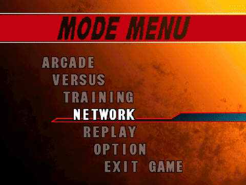

# 3SXtra

[](https://github.com/3sxtra/3sxtra/actions/workflows/build_windows.yml)
[](https://github.com/3sxtra/3sxtra/actions/workflows/build_linux.yml)
[](https://github.com/3sxtra/3sxtra/actions/workflows/build_linux_arm64.yml)
[](https://github.com/3sxtra/3sxtra/actions/workflows/build_macos.yml)
[](LICENSE)

A modernized fork of **Street Fighter III: 3rd Strike** — modern GPU rendering, rollback netplay, arcade bezels, HD stage mods.

> [!NOTE]
> Experimental, unofficial fork. macOS and mainline Linux are lightly tested. Raspberry Pi 4 / Batocera is the primary Linux target.

Binary: `3sx` (`3sx.exe` on Windows).

---

## Quick Start

1. Place your legally obtained `.afs` ROM in the `rom/` directory.
2. Run `3sx.exe` (Windows) or `./3sx` (Linux / macOS).
3. *Optional*: Create an empty `config/` folder next to the executable for portable mode.

---

## Rendering

| Backend | API | Notes |
|---|---|---|
| **OpenGL 3.3+** | GLSL | Texture array batching, PBO async uploads, compute-shader palette conversion |
| **SDL_GPU** | Vulkan / Metal / DX12 | Via SDL3's `SDL_GPU` API |
| **SDL2D** | SDL3 2D | Software fallback |

Select with `--renderer gl`, `--renderer gpu`, or `--renderer sdl`.

### Shaders (librashader)
Load any RetroArch `.slangp` preset at runtime. Hot-swap from the shader picker (**F2**).

### Bezels
40+ per-character arcade bezels. Auto-swap on character change, reset on menus.

### HD Stage Backgrounds
Per-stage multi-layer parallax backgrounds at output resolution. Drop assets in `assets/stages/stage_XX/`. Toggle via **F3**.

---

## Controls & Hotkeys

| Key | Function |
|---|---|
| **F1** | Main menu (input mapping, options, save/load) |
| **F2** | Shader picker |
| **F3** | Mods menu (HD backgrounds, visual mods) |
| **F4** | Cycle shader mode |
| **F5** | Toggle frame-rate uncap |
| **F6** | Stage config |
| **F7** | Training options |
| **F8** | Cycle scale mode |
| **F9** | Cycle shader preset |
| **F10** | Diagnostics (FPS, netplay stats) |
| **F11** | Toggle fullscreen |
| **F12** | Input-lag test |
| **Alt+Enter** | Toggle fullscreen |
| **` (Grave)** | Screenshot |
| **9** | Debug pause / frame-step |
| **0** | Debug overlay (72 options) |

---

## Audio

FFmpeg **removed**. Built-in ADX decoder, zero external audio dependencies.

Master volume: `--volume 0–100`.

Custom audio mods: drop files in `assets/bgm_mod/` (music) or `assets/voice_mod/` (voices).

---

## Save System & Replays

Native save system replaces PS2 memory card emulation:

- `options.ini` — settings and controls
- `direction.ini` — system direction
- `replays/` — binary replay files with metadata sidecars
- Atomic writes (crash-safe)
- 20-slot replay picker with date, characters, and status

Files go to your user profile, or `config/` in portable mode.

---

## Netplay



Built on GekkoNet GGPO rollback netcode.

| Feature | Details |
|---|---|
| **STUN hole-punching** | Discovers public endpoint, punches through NAT |
| **UPnP fallback** | Auto-opens UDP port on compatible routers |
| **Lobby server** | Node.js, zero deps, HMAC-SHA256 auth |
| **In-game lobby** | Native and RmlUi lobby screens, no CLI required |
| **Async comms** | HTTP lobby traffic on background thread |
| **LAN support** | Dedicated LAN lobby with local IP display |
| **Region filtering** | Filter by region for lower latency |
| **Client ID** | Stable fingerprint prevents username spoofing |
| **Desync prevention** | Frame 0 reset, 17 expanded rollback fields, pointer-safe checksums |
| **Sync test** | Automated sync-test with Python runner |

Start from in-game **Network** menu or CLI: `3sx 1 192.168.1.100`

---

## Performance


All fork-only optimizations:

| Optimization | Details |
|---|---|
| **SIMDe vectorization** | SSE2/NEON for palette LUT conversion |
| **Texture array batching** | `GL_TEXTURE_2D_ARRAY` single-bind rendering |
| **Persistent mapped buffers** | Triple-buffered VBOs, no per-frame stalls |
| **PBO async uploads** | Overlaps CPU conversion with GPU upload |
| **GPU palette compute** | Compute shader palette lookup |
| **Active voice bitmask** | Skips silent audio channels |
| **RAM asset preload** | All assets in memory at startup |
| **Hybrid frame limiter** | Smooth pacing on RPi (compensates kernel jitter) |
| **LTO + PGO** | Link-Time and Profile-Guided Optimization |

---

## Platform Support

| Platform | Status |
|---|---|
| **Windows** (x86-64) | Primary dev platform |
| **Raspberry Pi 4 / Batocera** | Full cross-compilation + integration |
| **Linux x86-64** | Tested |
| **Linux ARM64** | Native support |
| **macOS** (Intel + Apple Silicon) | Builds, not actively tested |
| **Flatpak** | Packaging defined, not actively tested |

### Portable Mode
Create `config/` next to the executable. All saves, replays, and settings stay local.

### Video Broadcasting
- **Windows** — Spout2
- **macOS** — Syphon
- **Linux** — PipeWire *(WIP)*

---

## CLI Options

```
Usage: 3sx [options] [player_side remote_ip]

  --renderer <backend>       gl, gpu, sdl, or classic (default: gl)
  --volume 0-100             Master volume (default: 100)
  --scale <factor>           Resolution multiplier (default: 1)
  --port <number>            Netplay UDP port (default: 50000)
  --window-pos <x>,<y>       Window position
  --window-size <w>x<h>      Window size
  --ui <rmlui>               UI toolkit for overlay menus
  --enable-broadcast         Enable Spout/Syphon/PipeWire output
  --shm-suffix <suffix>      Shared-memory name for broadcast
  --font-test                Boot into font debug screen
  --help                     Show help

Netplay shorthand:
  3sx 1 192.168.1.100        Connect as P1
  3sx 2 192.168.1.100        Connect as P2
```

---

## Building

See [Build Guide](docs/building.md) for full instructions.


### Project Structure

```text
3sxtra/
├── src/
│   ├── sf33rd/Source/Game/   # Core game engine (C)
│   └── port/sdl/            # SDL3 port layer (render, input, net, rmlui)
├── assets/                  # Bezels, stages, UI, audio mods
├── shaders/                 # GLSL / SPIR-V
├── tests/                   # CMocka unit tests
├── tools/                   # Build scripts, sync-test, Batocera tooling
├── deploy/                  # Deployment layout
├── docs/                    # Build guide
├── third_party/             # Vendored dependencies
├── .github/workflows/       # CI pipelines
└── CMakeLists.txt
```

---

## Dependencies

**Added:** GLAD, SIMDe, stb_image, librashader, SDL_shadercross, RmlUi, Dear ImGui, CMocka, Tracy, Spout2

**Removed:** FFmpeg — replaced by built-in ADX decoder

SDL3 tracks `main` branch (upstream pins a release tarball).

---

## Licenses

See [`THIRD_PARTY_NOTICES.txt`](THIRD_PARTY_NOTICES.txt) for full texts.

| Library | License |
|---|---|
| [GekkoNet](https://github.com/HeatXD/GekkoNet) | MIT |
| [SDL3](https://github.com/libsdl-org/SDL) | zlib |
| [SDL\_shadercross](https://github.com/libsdl-org/SDL_shadercross) | zlib |
| [RmlUi](https://github.com/mikke89/RmlUi) | MIT |
| [Dear ImGui](https://github.com/ocornut/imgui) | MIT |
| [librashader](https://github.com/SnowflakePowered/librashader) | MPL-2.0 |
| [GLAD](https://github.com/Dav1dde/glad) | MIT |
| [SIMDe](https://github.com/simd-everywhere/simde) | MIT |
| [stb\_image](https://github.com/nothings/stb) | Public Domain / MIT |
| [Spout2](https://github.com/leadedge/Spout2) | BSD 2-Clause |
| [Tracy](https://github.com/wolfpld/tracy) | BSD 3-Clause |
| [CMocka](https://cmocka.org) | Apache 2.0 |
| [zlib](https://zlib.net) | zlib |
| [libcdio](https://github.com/libcdio/libcdio) | GPLv3+ |
