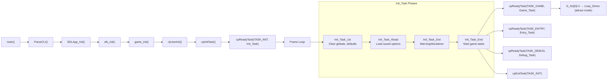

# 3SX Game State Engine — Deep Dive

## 1. Architecture Overview

The game state engine is a **three-tier hierarchical state machine** running inside a **cooperative task scheduler**. The entire system was originally designed for arcade/PS2 hardware and has been progressively modernized with a data-driven MenuScreen registry-based architecture and RmlUi overlays.

The rollbacking mechanism relies on a composite state consisting of both [`GameState`](src/include/game_state.h) (core waypoints, player positions, etc.) and [`EffectState`](src/include/game_state.h) (transient visual effects, timers, etc.).

```mermaid
graph TD
    subgraph "Task Scheduler (cpLoopTask)"
        INIT["TASK_INIT<br/>Init_Task()"]
        ENTRY["TASK_ENTRY<br/>Entry_Task()"]
        RESET["TASK_RESET<br/>Reset_Task()"]
        MENU["TASK_MENU<br/>Menu_Task()"]
        PAUSE["TASK_PAUSE<br/>Pause_Task()"]
        GAME["TASK_GAME<br/>Game_Task()"]
        SAVER["TASK_SAVER<br/>Saver_Task()"]
        DEBUG["TASK_DEBUG<br/>Debug_Task()"]
    end

    subgraph "Game_Task — G_No[0] Top-Level Modes"
        WAL["G_No[0]=0<br/>Wait_Auto_Load"]
        LOOP["G_No[0]=1<br/>Loop_Demo (attract)"]
        GAME_MODE["G_No[0]=2<br/>Game() — active play"]
    end

    GAME --> WAL
    GAME --> LOOP
    GAME --> GAME_MODE

    subgraph "Game() — G_No[1] States (0–12)"
        G00["G_No[1]=0 — Title Screen"]
        G01["G_No[1]=1 — Character Select"]
        G02["G_No[1]=2 — Fight"]
        G03["G_No[1]=3 — Win/Loss Result"]
        G04["G_No[1]=4 — Loser Scene"]
        G05["G_No[1]=5 — Next CPU"]
        G06["G_No[1]=6 — Game Over"]
        G07["G_No[1]=7 — Continue"]
        G08["G_No[1]=8 — Ending"]
        G09["G_No[1]=9 — Bonus Stage"]
        G10["G_No[1]=10 — Post-Bonus"]
        G11["G_No[1]=11 — Next Q (special)"]
        G12["G_No[1]=12 — Menu → Select Transition"]
    end

    GAME_MODE --> G00
    GAME_MODE --> G01
    GAME_MODE --> G02
    GAME_MODE --> G12
```



## 2. The State Machine Hierarchy

### 2.1 `G_No[0]` — Top-Level Mode (3 values)

| Value | Function           | Purpose                                                              |
| ----- | ------------------ | -------------------------------------------------------------------- |
| 0     | `Wait_Auto_Load()` | Idle while assets load (renders background)                          |
| 1     | `Loop_Demo()`      | Attract-mode demo loop (logo → title → demo fight → ranking → cycle) |
| 2     | `Game()`           | Active gameplay (dispatches to G_No[1])                              |

### 2.2 `G_No[1]` — Game States (13 values: Game00–Game12)

| State  | Name                   | Key Transitions                                            |
| ------ | ---------------------- | ---------------------------------------------------------- |
| **0**  | Title Screen           | → 12 (menu transition)                                     |
| **1**  | Character Select       | → 2 (fight start)                                          |
| **2**  | Fight (8 sub-states)   | → 3 (win), 4 (loss), 9 (bonus)                             |
| **3**  | Win/Loss Result        | → 5 (next CPU), 12 (VS menu), 8 (ending), 11 (next Q boss) |
| **4**  | Loser Scene            | → 7 (continue)                                             |
| **5**  | Next CPU Opponent      | → 2 (next fight), 9 (bonus stage)                          |
| **6**  | Game Over              | → ranking → attract loop (G_No[0]=1)                       |
| **7**  | Continue Countdown     | → 6 (game over)                                            |
| **8**  | Ending Sequence        | → 6 (game over / credits)                                  |
| **9**  | Bonus Stage            | → 10 (post-bonus)                                          |
| **10** | Post-Bonus             | → 2 (next fight)                                           |
| **11** | Next Q (Special Boss)  | → 2 (fight) or 9 (bonus)                                   |
| **12** | Menu→Select Transition | → 1 (char select)                                          |

### 2.3 `G_No[2]` and `G_No[3]` — Sub-States

Each Game state uses `G_No[2]` and sometimes `G_No[3]` as sub-state indices for multi-phase sequences (e.g., Game02 has 8 sub-states for round setup, fighting, inter-round transitions).

## 3. ModeType — The Game Mode Enum

Defined in [types.h](../src/include/types.h#L39-L47):

```c
typedef enum ModeType {
    MODE_ARCADE,           // Single-player vs CPU ladder
    MODE_VERSUS,           // Local 2-player
    MODE_NETWORK,          // Online netplay (GekkoNet rollback)
    MODE_NORMAL_TRAINING,  // Training mode
    MODE_PARRY_TRAINING,   // Parry training
    MODE_REPLAY,           // Replay playback
    MODE_TRIALS,           // Trial challenges
} ModeType;
```

> [!IMPORTANT]
> `Mode_Type` is the global that controls branching within Game states (e.g., Game01 plays different BGM for arcade vs. VS, Game2_0 sets up RNG differently for network, Game03 branches to different post-match flows).

## 4. The Task Scheduler

The scheduler operates with a fixed capacity of `TASK_SLOT_COUNT` (11 slots), using a cooperative (non-preemptive) model, defined in [main.c](../src/main.c#L662-L712):

| Slot | Name       | Purpose                                       |
| ---- | ---------- | --------------------------------------------- |
| 0    | TASK_INIT  | Boot sequence (Init_Task) — exits after setup |
| 1    | TASK_ENTRY | Coin-insert / start button handling           |
| 2    | TASK_RESET | Soft reset handling                           |
| 3    | TASK_MENU  | Menu system (Menu_Task)                       |
| 4    | TASK_PAUSE | Pause menu                                    |
| 5    | TASK_GAME  | Main game loop (Game_Task)                    |
| 6    | TASK_SAVER | Auto-save processing                          |
| 7    | Slot 7     | Reserved/Unused                               |
| 8    | Slot 8     | Reserved/Unused                               |
| 9    | TASK_DEBUG | Debug overlays                                |
| 10   | Slot 10    | Reserved/Unused                               |

Tasks use a `condition` flag: 0=inactive, 1=active, 2=ready (activates next frame), 3=paused.

## 5. The Boot Sequence

The boot sequence is orchestrated by `njUserInit()`, which serves as the primary subsystem initializer, ensuring that memory management, sequencers, and PPG/Zlib resources are correctly initialized before the task scheduler begins processing tasks of type `TASK_INIT`.



> [!NOTE]
> There's already a **font-test mode** precedent: `--font-test` CLI flag replaces `Game_Task` with `FontTest_Task` in `Init_Task_End()`. This is exactly the pattern you'd use for custom boot modes.

## 6. The Menu System

### 6.1 Legacy Menu

`Menu_Task()` in [menu.c](../src/sf33rd/Source/Game/menu/menu.c) dispatches via `task_ptr->r_no[0]` to 14 `MenuState` values, and then via `r_no[1]` to specific sub-screens.

### 6.2 Modern MenuScreen Registry

The legacy jump tables have been **migrated** to a data-driven [MenuScreen registry](../src/port/menu_screen_registry.c):

- **~40 named screens** with lifecycle callbacks (`on_enter`, `on_tick`, `on_exit`)
- **Phase state machine**: ENTER → WAIT → FADE_IN → ACTIVE → FADE_OUT → EXIT
- **RmlUi integration**: Each screen can show/hide its RmlUi document
- **Three dispatch contexts**: After_Title (main menus), Training, In_Game

Screen implementations live in [src/port/screens/ms\_\*.c](../src/port/screens/).

## 7. Configuration System

Two layers:

1. **INI Config** (`config.c`): Persistent key-value store in `config.ini`, loaded at startup via `Config_Init()`. Supports bool/int/string values with `CFG_KEY_*` constants.

2. **CLI Parser** (`cli_parser.c`): Handles `--scale`, `--renderer`, `--plugin`, `--port`, `--font-test`, `--ui`, `--volume`, etc.

3. **Configuration struct** (`main.h`/`main.c`): Runtime `Configuration configuration` struct holding netplay port, test runner settings, renderer plugin config, and original argc/argv.

---

## 8. Proposed Architecture for Application Modes

### 8.1 Concept: `AppMode`

A new top-level concept that controls the **entire application flow** — what boot sequence to run, which menu screens to show, what the attract loop does, and how gameplay is configured.

```c
typedef enum AppMode {
    APP_MODE_DEFAULT,       // Current behavior: attract → title → menu → play
    APP_MODE_ARCADE_BOOT,   // Arcade cabinet: skip menus, fixed difficulty, attract loop
    APP_MODE_TOURNAMENT,    // Tournament: fixed settings, round count, no continues
    APP_MODE_KIOSK,         // Kiosk/demo: time-limited sessions, auto-reset
    APP_MODE_TRAINING_ONLY, // Boot directly into training mode
    APP_MODE_SPECTATOR,     // Replay-only mode for stream setups
    APP_MODE_LAN_LOBBY,     // Direct boot into local network lobby
} AppMode;
```

### 8.2 Integration Points

There are **five key injection points** where `AppMode` would modify behavior:

| #   | Location                                         | What Changes                                                         |
| --- | ------------------------------------------------ | -------------------------------------------------------------------- |
| 1   | **CLI/Config** — `cli_parser.c` + `config.h`     | New `--mode <name>` arg + `CFG_KEY_APP_MODE` config key              |
| 2   | **Boot** — `Init_Task_End()` in `init3rd.c`      | Skip attract loop, jump to specific G_No state, pre-select Mode_Type |
| 3   | **Menu** — `MenuScreen_Goto()` / `After_Title()` | Restrict available menu items, auto-select modes                     |
| 4   | **Game States** — `game.c` Game03/06/07          | Disable continue screen, force game-over after N rounds, etc.        |
| 5   | **Loop_Demo** — `Loop_Demo()` in `game.c`        | Custom attract sequences for cabinets                                |

### 8.3 Example: Arcade Boot Mode

```
--mode arcade-boot
```

Would:

- Skip the disclaimer/warning screen (`Init_Task_2nd`)
- Start at title screen immediately (no Capcom logo)
- Set `Mode_Type = MODE_ARCADE` and lock it
- Remove Training/Network/Replay from mode select menu
- Enforce system direction settings (difficulty, timer, rounds) from config
- Enable the classic attract-mode demo loop with coin-insert detection
- Disable pause menu (or limit to "soft reset" only)

### 8.4 Example: Tournament Mode

```
--mode tournament
```

Would:

- Skip directly to character select (`G_No[1] = 1`)
- Set `Mode_Type = MODE_VERSUS` and lock it
- Force 2/3 or 3/5 round count from config
- Disable continue screen (`Game07` → skip to game-over)
- Disable pause for non-organizer controllers
- Show a tournament bracket or match counter overlay (RmlUi)
- Auto-reset to character select after match conclusion
- Optionally auto-save replays

### 8.5 Example: Kiosk Mode

```
--mode kiosk
```

Would:

- Set `Mode_Type = MODE_ARCADE`
- Set a strict session timer overlay
- Restrict pause menu
- Force auto-reset to attract loop if idle for too long or match finishes
- Prevent accessing configuration menus

### 8.6 Example: Training Only Mode

```
--mode training-only
```

Would:

- Skip main menus and immediately enter `MENU_SCREEN_TRAINING_MODE`
- Set `Mode_Type = MODE_NORMAL_TRAINING`
- Restrict exit to OS or soft reset instead of returning to main menu

### 8.7 Example: Spectator Mode

```
--mode spectator
```

Would:

- Boot directly to replay menu or connect to lobby purely as a spectator
- Set `Mode_Type = MODE_REPLAY` or `MODE_NETWORK` with spectator flags
- Restrict any input that affects match state
- Show custom broadcast/spectator UI overlays

### 8.8 Example: LAN Lobby Mode

```
--mode lan
```

Would:

- Skip the disclaimer/warning screen (`Init_Task_2nd`)
- Skip the title screen and main menus entirely
- Set `Mode_Type = MODE_NETWORK` and lock it
- Immediately invoke `MenuScreen_Goto(MENU_SCREEN_NETWORK_LOBBY_LAN)`
- Restrict exiting the lobby (backing out could exit to OS or just reset the connection)
- Ideal for offline event setups or head-to-head arcade cabinets connected via local network

### 8.9 Where it fits in the existing code

> [!TIP]  
> The existing `g_font_test_mode` in `Init_Task_End()` is exactly the right pattern. You'd extend it with an `AppMode g_app_mode` global that gates behavior at the five injection points above.

The `MenuScreen` registry already supports this well — you can:

- Remove screens by not mapping them in `g_legacy_to_screen[]`
- Add new screens (e.g., `MENU_SCREEN_TOURNAMENT_LOBBY` already exists!)
- Skip screens by calling `MenuScreen_Goto()` directly from `Init_Task_End()`

The `Configuration` system supports this because config.ini keys are simple strings — you'd add `app-mode`, `tournament-rounds`, `arcade-difficulty`, etc.

---

## 9. Key Files Reference

| File                                                                    | Purpose                                         |
| ----------------------------------------------------------------------- | ----------------------------------------------- |
| [game.c](../src/sf33rd/Source/Game/game.c)                              | Master state machine (Game00–Game12, Loop_Demo) |
| [init3rd.c](../src/sf33rd/Source/Game/init3rd.c)                        | Boot sequence (Init_Task)                       |
| [main.c](../src/main.c)                                                 | Entry point, task scheduler, frame loop         |
| [menu.c](../src/sf33rd/Source/Game/menu/menu.c)                         | Menu state machine                              |
| [menu_screen_registry.c](../src/port/menu_screen_registry.c)            | Modern MenuScreen registry                      |
| [menu_screen.h](../src/include/port/menu_screen.h)                      | MenuScreen types & API                          |
| [types.h](../src/include/types.h)                                       | ModeType enum                                   |
| [workuser_system.h](../src/sf33rd/Source/Game/engine/workuser_system.h) | G_No, Mode_Type, game globals                   |
| [game_state.h](../src/include/game_state.h)                             | Rollback serialization struct                   |
| [cli_parser.c](../src/port/config/cli_parser.c)                         | CLI argument handling                           |
| [config.h](../src/port/config/config.h)                                 | INI config key definitions                      |
| [work_sys.h](../src/sf33rd/Source/Game/system/work_sys.h)               | Save slots, system state                        |

## 10. Considerations

> [!WARNING]
> **Netplay Rollback**: The `GameState` struct in `game_state.h` serializes most of the game globals for rollback. Any new mode-specific state that affects deterministic simulation must be added to `GameState`, `GameState_Save()`, and `GameState_Load()`. UI-only state (which menu screen is shown) is safe to leave out.

> [!WARNING]
> **Pointer and Rendering Sanitization**: To ensure deterministic checksums own rollback, all transient pointers within the state must be sanitized. This includes zeroing out waypoints or address pointers such as `target_adrs`, `hit_adrs`, etc., before serialization to prevent non-deterministic memory addresses from affecting the hash.

> [!IMPORTANT]
> **Mode_Type vs. AppMode**: These are different axes. `Mode_Type` controls _in-game behavior_ (arcade vs. VS vs. training). `AppMode` would control the _application shell_ (boot flow, menu layout, session rules). A tournament `AppMode` could still use `MODE_VERSUS` as the `Mode_Type`. They compose, not conflict.

## 11. Debugging Case Study: Option Select Lockup

During the modernization of the Option Menu (`ms_option_select.c`) to the NativeUI framework, a critical UI lockup occurred where no text rendered and the game stopped responding to inputs.

### Root Cause Analysis

The deadlock was triggered by an interaction between legacy `MC_Move_Sub` validation and the declarative NativeUI loop:

1. **The `Menu_Cursor_Move` Semaphore Deadlock:**
   The legacy menu engine uses a global variable `Menu_Cursor_Move` initialized to the number of items spawning (e.g., `7` or `8` items). Each text label (`effect_61`) and the red cursor highlight (`effect_64`) decrements this counter when their entrance animation ("slide in") finishes.
   While `Menu_Cursor_Move > 0`, the input routine `MC_Move_Sub` forcefully returns `0` and ignores all controller states, treating the menu as "currently animating".
   
2. **Missing Cursor Initialization:**
   The modernization properly spawned `effect_61` text labels via `NativeUI_Button()`, but explicitly removed the manual `effect_64` cursor initialization in `option_select_enter()`. Because the cursor's slide-in never resolved, the semaphore `Menu_Cursor_Move` never hit `0`, leaving the system completely locked.

3. **Input Dispatch Trap (Early Return):**
   Prior to `Menu_Cursor_Move` reaching `0`, the local `IO_Result` never registers user action. Consequently, an overly aggressive input switch case with `default: return;` would exit the `tick` routine entirely, failing to finalize NativeUI garbage collection logic and blocking all exits.

### Logical Next Steps

To resolve this mechanical deadlock, we need to apply three targeted fixes to `ms_option_select.c`:
1. **Restore `effect_64_init`**: We must manually restore the legacy cursor (`effect_64`) initialization in `option_select_enter()` so its entrance animation can finish and decrement the `Menu_Cursor_Move` semaphore, unlocking the input layer exactly like before.
2. **Remove Early Return Trap**: Remove the `default: return;` inside the `IO_Result` switch in `option_select_tick()` so that `NativeUI_End()` state and garbage collection resolve completely on every tick.
3. **Verify Slot Allocation Boundary**: Ensure `NativeUI` dynamically spawned buttons do not collide with hardcoded legacy slots like the background lines (`0x48`) or cursor (`0x64`). Review `UI_SLOT_MIN` and verify all elements spawn safely.
